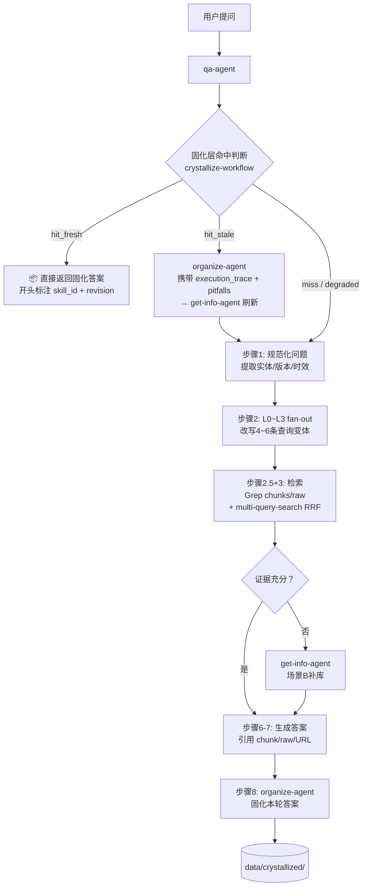
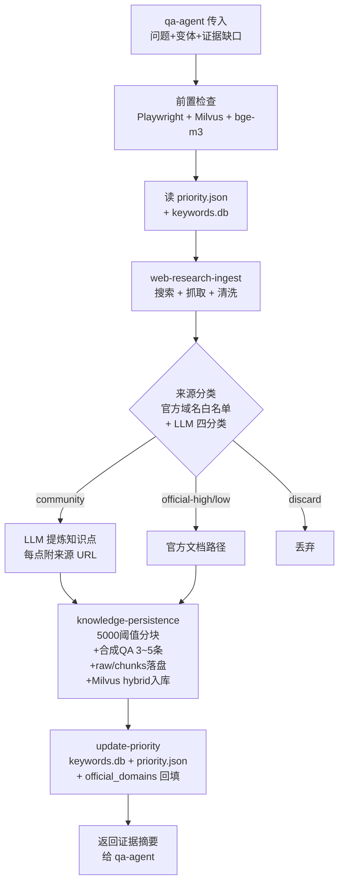
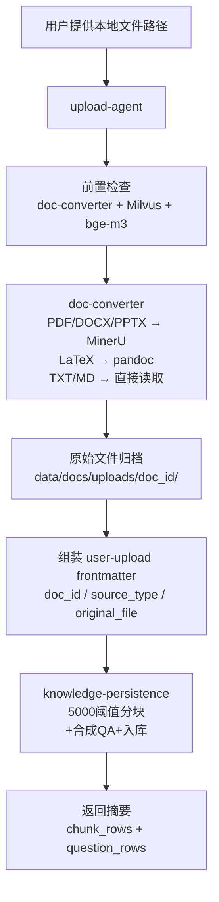
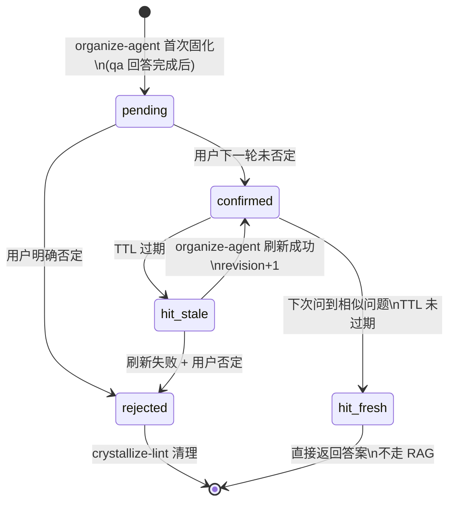

# Brain-Base Charter

> 本文档是 Brain-Base 的**第一性原理定义与流程锚点**。它回答"是什么、为什么、用在哪、怎么运作、现在差什么"五个问题，作为后续所有开发决策的起点。如果一个新功能与本文档的定义冲突，要么修改功能，要么先更新本文档并说明理由。

---

## 一、第一性原理：Brain-Base 是什么

### 1.1 一句话定义

**Brain-Base 是一个以 Claude Code Agent 为驱动的、可持续自进化的个人知识闭环系统。**

它不是"又一个 RAG 脚本"，也不是"向量数据库的 UI"。它的本质是：

> **把分散在网络、本地文档、历史问答里的知识，系统性地收集、存储、检索、积累，并让每次成功的问答都成为下一次的加速器。**

### 1.2 为什么需要它——从用户真实痛苦出发

一个重度使用 Claude Code 做开发的工程师，会反复遭遇这些痛苦：

| 痛苦 | 根因 |
|------|------|
| 同样的问题反复查、反复答 | LLM 没有持久记忆，每次会话独立 |
| 找到了好资料但下次找不到了 | 没有统一的知识存储 |
| 知道某篇文档存在，但 grep 不到 | 原始 PDF/Word/PPT 无法被检索 |
| 联网查到的答案下次可能已过时 | 知识库只存了结果，没有溯源和刷新机制 |
| 补库成本高，不知道哪些站值得优先抓 | 没有站点优先级管理 |
| 问答结果无法积累，每次都重跑全链路 | 缺少答案固化层 |

### 1.3 核心价值主张（三条不可妥协的线）

1. **可追溯**：每个答案必须能回到 chunk → raw → 来源 URL，不允许模型凭空捏造。
2. **可演进**：每次补库的知识都能被后续检索复用，知识库随使用而增长。
3. **可积累**：成功回答过的问题应固化为可复用的答案，相似问题不再重跑全链路。

这三条是 Brain-Base 区别于"每次直接问 Claude"的核心理由。违反任何一条的设计决策，都应被质疑。

### 1.4 与现有工具的差异化

| 工具 | 定位 | Brain-Base 的不可替代点 |
|------|------|------------------------|
| Obsidian | 笔记管理，手动维护 | Brain-Base 由 Agent 自动补库，不依赖人工整理 |
| RAGFlow / MaxKB / Dify | RAG 平台，通用 | Brain-Base 专为 Claude Code 深度集成，Agent 调用链原生 |
| 直接问 Claude | 一次性问答 | Brain-Base 有持久存储层，答案可追溯、可复用 |
| 向量数据库（Milvus） | 存储与检索 | Brain-Base 在向量库之上有文件系统双副本 + 固化答案层 |
| 浏览器书签 / Notion | 手动收藏 | Brain-Base 通过 Playwright 自动抓取、清洗、入库 |

**不可替代的核心**：Brain-Base 是一个**闭环**——从问题触发，到补库，到入库，到固化，到下次命中，全程由 Agent 自动驱动，人只需要提问和反馈。

---

## 二、使用场景分析（产品视角）

> 这一章不是复述当前实现，而是从**用户真实行为**出发，分析每个场景的本质需求、当前系统的应对方式、以及被忽视或设计错误的地方。

---

### 2.1 用户是谁，他的真实工作流是什么

Brain-Base 的用户是**重度使用 Claude Code 的工程师**，他的典型工作日是这样的：

1. 打开一个新 Claude Code 会话，开始做某个技术任务。
2. 遇到不确定的 API 用法 / 配置项 / 架构决策，需要查资料。
3. 可能直接问 Claude（靠训练数据），可能去查文档，可能翻之前自己存的笔记。
4. 得到答案，继续干活。
5. 几周后同样的问题又来了——但上次的答案在哪里？

**用户的核心诉求不是"问答"，而是"我不想重复劳动"。** 他想要的是：上次费了功夫查到的东西，这次能立刻找回来，而且是可信的、不过时的。

这个认识有一个重要推论：**Brain-Base 的竞争对手不是 RAGFlow，而是用户自己的记忆和习惯**。如果 Brain-Base 比"直接问 Claude"还麻烦，用户就不会用它。

---

### 2.2 已有场景的深度分析——系统没想清楚的地方

#### 场景 A：问答

**表面上：** 用户问问题，系统从知识库里找答案。

**真正的问题是：** 用户在什么情况下会"决定开启 Brain-Base" 而不是直接问 Claude？

当前系统**假设用户主动意识到需要查知识库**，然后启动 qa-agent。但真实情况是：

- 用户不知道知识库里存了什么。"存了什么"本身是个黑盒。
- 如果上次补库是三个月前，用户可能完全忘了这个领域已经有本地知识了。
- **系统缺少一个入口：让用户知道知识库里有什么，以便在问问题之前做出"用 Brain-Base vs 直接问 Claude"的判断。**

被忽略的子需求：
- **知识库可视化**：现在存了多少 chunk？覆盖了哪些主题？最近一次更新是什么时候？→ 完全没有。
- **主动推送**：某个领域的文档快过期了，系统应该提醒用户，而不是等到 hit_stale 才触发。→ 没有。
- **问答置信度**：当答案来自一个 2025 年的文档而用户问的是 2026 年的情况，系统应该主动标注"这条知识距今 13 个月"，而不是隐藏时间信息。→ 当前固化层有 TTL，但对基础 RAG 层无类似机制。

---

#### 场景 B：联网补库

**表面上：** 本地没有 → 去网上找 → 存回来。

**真正的问题是：** 这条链路**成本极高**（Playwright 抓取 + LLM 分块 + 合成 QA + Milvus 入库）。每次都走这条链路意味着：

1. 一次问答从几秒变成几分钟。
2. 用户在等待期间切换上下文，丢失专注力。
3. 如果补库失败（网络不通、Playwright 崩溃、Milvus 未启动），用户得到的是错误信息而不是答案。

**系统设计了一个"完美闭环"，但没有设计"降级体验"。**

被忽略的子需求：
- **补库与回答分离**：用户现在的实际需求是"先给我一个答案（哪怕来自 Claude 的训练数据），后台异步补库"。但当前设计是"先补库再回答"，这在 Milvus 未启动时直接失败。
- **补库是否必须由问答触发？** 更自然的模式应该是：用户可以**主动告诉系统"我最近在研究 X 话题，帮我把相关文档补进来"**，这是独立的补库意图，不依赖问答链路。当前这个入口存在（get-info-agent 可以直接调用），但没有在使用文档里突出。
- **重复补库浪费**：同一个 URL 被多次抓取时，当前靠 doc_id 日期去重，但没有检测"内容是否真的变了"的机制。每次补库都会产生新的 `doc_id-YYYY-MM-DD`，知识库里堆积大量同主题历史版本，检索时会产生噪声。

---

#### 场景 C：本地文档上传

**表面上：** 用户有 PDF，想存进知识库。

**真正的问题是：** 用户在什么时间点想上传文档？

1. **一次性大批量导入**：比如整理硬盘里几年积攒的论文，一次性导入 50 篇 PDF。当前设计是"禁止并行，顺序处理"——50 篇 PDF 可能需要跑几个小时，用户没有进度反馈，也不知道哪些成功了哪些失败了。**没有批量任务队列和断点续传。**

2. **增量添加**：用户下载了一篇新论文，立刻想入库。这个场景最顺畅，当前基本可以做到。

3. **已在会话中使用的文档**：用户在 Claude Code 中打开了一个 PDF 文件，问了几个问题，现在想把它存进知识库。这时候 upload-agent 的入口在哪？**没有从"当前文件"到"入库"的快捷路径。**

4. **笔记/代码**：用户自己写的笔记（`.md` 文件）、代码注释（`.py`，`.ts`）里有重要知识，想纳入知识库。当前 TXT/MD 支持，但**代码文件格式（`.py`, `.ts`, `.go`）不在支持列表**，而代码对工程师来说是最重要的知识载体之一。

---

#### 场景 D：固化层（知识积累）

**表面上：** 答过的问题固化，相似问题直接返回。

**真正的问题是：** 固化层的命中机制依赖"关键词粗筛 + LLM 语义判断"，**这在知识库里有 200+ 条固化答案时会变得很贵**。每次问答的第一步都要 LLM 遍历整个索引做语义判断，延迟和成本线性增长。

更深的问题：**固化层解决的是"什么问题"？**

它解决的是"已经被问过、已经被答过"的问题的二次命中——也就是说，固化层对**新问题完全没用**，对**老问题才有价值**。用户使用 Brain-Base 初期（知识库里问题少），固化层带来的加速收益接近零，却在每次问答时都增加一步判断开销。

被忽略的问题：
- **什么问题值得固化？** 当前策略是"所有完整回答都固化"。但一次性的、极度个人化的问题（"我今天开的那个 PR 里有没有忘记加注释？"）固化了也没价值，只会污染索引。**缺少固化价值判断的过滤器。**
- **固化答案的可发现性**：用户不知道固化层里存了什么答案，无法浏览或搜索固化层。如果他想主动确认某个答案是否已经固化，或者想修改一条固化答案，没有任何入口。

##### 新设计：固化冷热分层

借鉴 `priority.json` 对站点的冷热管理思路，固化层应该有同构的分层机制：

```
           ┌─────────────────────────┐
回答完成 ──▶│ organize-agent 价值评分  │
           └────────────┬────────────┘
                        │
          ┌─────────────┴──────────────┐
          │                            │
     value >= 阈值                value <  阈值
          │                            │
          ▼                            ▼
┌──────────────────┐          ┌──────────────────┐
│ 活跃固化层        │          │ 冷藏固化层        │
│ data/crystallized│          │ data/crystallized/cold│
│                  │◀── 晋升 ─┤                  │
│ 参与 hit check   │   N 次   │ 不参与 hit check │
│ 会被 stale 刷新  │          │ 只累计 hit_count │
└──────────────────┘          └──────────────────┘
          │                            │
          └─────── crystallize-lint ───┘
                  周期性降级/清理
```

**价值评分维度**（由 organize-agent 在固化前判断）：
- **通用性**：问题是否可能被不同用户/不同时间问到？（个人化极强的问题 → 低分）
- **稳定性**：答案是否依赖时效性强的证据？（一周内可能变 → 低分）
- **证据质量**：证据来自官方文档还是匿名社区？（社区 → 低分）
- **成本收益**：这次回答耗费了多少资源？（动用了 get-info 补库的问题 → 高分，更值得固化）

**冷藏层的角色**：
- 不是垃圾桶，是**观察区**。
- 每条冷藏答案有 `hit_count`（被类似问题触发的次数），当 hit_count 超过晋升阈值（比如 3 次）时，自动升级到活跃层。
- 类似 `priority.json` 的 `hotness_score` 对站点的加权——用户真实行为替系统决定什么值得保留。

**命中判断流程**：
1. qa-workflow 先查活跃固化层（现有逻辑不变）。
2. 未命中 → 查冷藏层（可选，低频）：如果有语义相似条目，`hit_count += 1`，达阈值则晋升后直接返回；未达阈值则把冷藏条目作为**额外证据**传给 qa-workflow 继续 RAG。
3. 全部未命中 → 走标准 RAG 流程。

**与旧设计的兼容性**：
- 旧 `data/crystallized/*.md` 全部视为"活跃层"，不动。
- 新增 `data/crystallized/cold/` 子目录，新写入按价值评分决定落哪里。
- `crystallize-lint` 扩展：周期性检查活跃层中长期无命中的条目，降级到冷藏；冷藏层中超过 `6 × TTL` 仍无命中的条目彻底清理。

---

### 2.3 完全被忽视的场景

这些场景在现有文档中从未被提及，但对于目标用户是真实存在的需求：

---

#### 盲区 1：知识库"现在有什么"——可检索性缺失

用户存了大量文档之后，面临一个新问题：**我不记得我存过什么**。

当前系统是被动的——用户问问题，系统才开始查。但用户需要一个**主动浏览知识库**的入口：

- "我知识库里和 Milvus 相关的文档都有哪些？"
- "最近三个月我入库了哪些文档？"
- "某个主题下有多少 chunk，来源是什么？"

当前的数据都存在，但**没有任何浏览/检索/统计接口**。用户需要直接查文件系统或写 SQL 查 SQLite 才能回答这些问题。这是严重的产品缺失。

---

#### 盲区 2：知识冲突检测

随着知识库增长，同一主题的文档会有多个版本（不同日期抓取）、不同来源（官方 vs 社区），其中可能存在相互矛盾的内容。

当前系统在**入库时**不检测冲突，在**检索时**把所有命中结果都扔给 LLM，由 LLM 自己判断哪条可信。但：

- 用户不知道冲突存在，更不知道系统返回的答案是否综合了矛盾来源。
- 旧版本文档永远不会被自动清除，只会堆积。

**缺少的能力**：入库时检测"该主题已有 N 个版本，最新版本日期是 X，是否覆盖？"，以及周期性的"知识库冲突扫描"。

---

#### 盲区 3：知识"来源可信度"分级

当前系统对来源的处理是：官方文档直接入库，社区内容提炼后入库。但这是**二元分类**，现实中来源质量是连续谱：

- Anthropic 官方文档 > Anthropic 博客 > 知名工程师博客 > 个人博客 > 匿名问答帖

当前系统**不携带来源可信度**进入 Milvus，也不在回答时区分"这条答案来自官方 API 文档"和"这条答案来自某个博客提炼"。用户无法判断答案的可靠程度。

---

#### 盲区 4：知识库用于代码生成辅助

用户不只是"问知识性问题"，他还会在写代码时用 Brain-Base。比如：

- "参考我知识库里的 MilvusHelper 实现，帮我写一个类似的 WeaviateHelper"
- "我之前入库的那个 API 文档，帮我生成对应的 Python SDK wrapper"

这类"以知识库为上下文做代码生成"的场景完全没有被考虑过。它需要的不是 QA 模式，而是**把相关 chunk 注入 Claude 的上下文窗口**，然后交由 Claude 做代码生成。当前 qa-agent 的输出是回答文本，不是可供代码生成使用的结构化上下文。

---

#### 盲区 5：跨会话的"当前任务"上下文

用户在研究某个技术话题时，往往横跨多个 Claude Code 会话（多天、多个 subagent）。他希望 Brain-Base 能记住"我最近在研究什么"，并在下次会话开始时主动提示：

- "你上次在研究 MCP server 配置，相关的 3 篇文档是 X/Y/Z，知识库上次更新是昨天。"
- "你有 2 条固化答案与当前任务相关，要先看一下吗？"

这是 Brain-Base 向**主动助手**演进的第一步。当前它完全是被动的——必须等用户开口。

---

#### 盲区 6：知识库的"退出"——数据导出与迁移

用户换了电脑、换了向量数据库（从 Milvus 换成 Chroma）、或者想把知识库分享给团队成员，需要**导出知识库**。

当前没有任何数据导出机制。`data/docs/raw/` 和 `data/docs/chunks/` 是可移植的（Markdown 文件），但 Milvus 中的向量、`data/crystallized/` 中的固化答案、`data/keywords.db` 中的优先级——这些要迁移需要用户自己搞清楚所有依赖关系。

对于个人知识系统，**数据自主权**（我的知识是我的，我能完整导出并在任何地方恢复）是基本需求，但从未被设计过。

---

### 2.4 场景优先级矩阵

| 场景 | 用户频率 | 当前体验 | 最大痛点 |
|------|---------|---------|---------|
| 问答（已有知识） | 极高 | 可用 | 不知道知识库里有什么，入口不清晰 |
| 问答（触发补库） | 高 | 慢且脆弱 | 补库失败=答案失败，无降级；等待时间长 |
| 本地文档入库 | 中 | 基本可用 | 批量导入无进度；代码文件不支持 |
| 固化层命中 | 中（初期低） | 可用但有隐性成本 | 遍历索引成本随规模线性增长 |
| 浏览/检索知识库内容 | 高（被忽视） | **不存在** | 完全空白 |
| 知识冲突处理 | 低（但影响大） | **不存在** | 冲突静默堆积，污染检索质量 |
| 代码生成辅助 | 高（被忽视） | **不存在** | 完全空白 |
| 数据导出/迁移 | 低（但关键时刻很重要） | **不存在** | 数据无法自主管理 |

---

## 三、端到端流程

### 3.1 主流程总览（场景 A → B → D 完整链路）



### 3.2 场景 B：外部补库流程



### 3.3 场景 C：本地文档上传流程



### 3.4 场景 D：固化层生命周期



---

## 四、组件职责矩阵

| 组件 | 类型 | 核心职责 | 不负责 |
|------|------|----------|--------|
| **qa-agent** | Agent | 问答调度：查固化层 → 检索 → 补库 → 回答 → 固化 | 直接写任何文件 |
| **get-info-agent** | Agent | 外部补库调度：Playwright抓取 → 清洗 → 入库 → 更新优先级 | 直接回答用户 |
| **upload-agent** | Agent | 本地文档入库调度：doc-converter → knowledge-persistence | 联网抓取 |
| **organize-agent** | Agent | 固化层调度：固化/刷新/反馈/健康检查 | 写原始层、直接综合答案 |
| **qa-workflow** | Skill | QA 全流程：固化命中判断 + fan-out + 检索 + 证据判断 + 答案 + 固化委托 | 网页抓取、文件写入 |
| **get-info-workflow** | Skill | 外部补库编排：前置检查 → 搜索 → 清洗 → 来源分类 → 提炼 → 入库 → 优先级更新 | QA 回答 |
| **upload-ingest** | Skill | 上传入库编排：校验 → doc-converter → frontmatter → knowledge-persistence | 联网、优先级更新 |
| **knowledge-persistence** | Skill | 持久化核心：LLM分块 + 合成QA + raw/chunks落盘 + Milvus hybrid入库 | 格式转换、网页抓取 |
| **crystallize-workflow** | Skill | 固化层读写：命中判断 + 新鲜度判断 + 写入 + 刷新 + 反馈 | 原始层写入、RAG检索 |
| **crystallize-lint** | Skill | 固化层健康检查：清理rejected/过期/孤儿/损坏 | 固化内容写入 |
| **web-research-ingest** | Skill | 网页搜索+抓取+初步清洗 | 分块持久化 |
| **playwright-cli-ops** | Skill | 稳定调用 Playwright-cli 的规范约束 | 内容理解 |
| **update-priority** | Skill | 更新 keywords.db + priority.json + official_domains回填 | 联网、问答 |
| **brain-base-skill** | Skill | 外部 Agent 调用说明书 | 实际执行任何功能 |
| **milvus-cli.py** | CLI | Milvus 交互：ingest/search/drop/check-runtime/inspect-config | 内容生成 |
| **doc-converter.py** | CLI | 格式转换：PDF/DOCX/PPTX → Markdown（MinerU/pandoc/直读） | 分块、入库 |
| **scheduler-cli.py** | CLI | 检测是否到优先级更新时间窗口 | 调度执行任务 |

### 两条入库路径的汇合点

```
外部补库路径（场景B）：
qa-agent → get-info-agent → get-info-workflow
  → web-research-ingest
  → knowledge-persistence  ←─ 汇合点
  → update-priority

本地上传路径（场景C）：
用户 → upload-agent → upload-ingest
  → doc-converter
  → knowledge-persistence  ←─ 汇合点（不经过 update-priority）
```

**knowledge-persistence 是整个系统中唯一的持久化汇合点，不允许绕过它直接写 Milvus 或 chunks。**

---

## 五、数据流向图

### 5.1 写入路径（谁往哪里写）

| 数据存储 | 写入者 | 内容 |
|---------|--------|------|
| `data/docs/raw/<doc_id>.md` | knowledge-persistence（来自 get-info）/ upload-ingest（来自 upload）| 完整清洗后的 Markdown + frontmatter |
| `data/docs/chunks/<doc_id>-NNN.md` | knowledge-persistence | 分块 Markdown + frontmatter（含 questions） |
| `data/docs/uploads/<doc_id>/` | doc-converter | 原始文件归档 + MinerU 抽取图片 |
| Milvus `knowledge_base` collection | milvus-cli.py ingest-chunks | dense+sparse 向量（chunk 行 + question 行） |
| `data/crystallized/<skill_id>.md` | organize-agent via crystallize-workflow | 固化答案 + execution_trace + pitfalls |
| `data/crystallized/index.json` | organize-agent via crystallize-workflow | 固化 skill 全局索引 |
| `data/priority.json` | update-priority | 站点优先级 + official_domains 白名单 |
| `data/keywords.db` | update-priority | 关键词热度 + 查询计数 |

### 5.2 读取路径（谁从哪里读）

| 读取者 | 读取来源 | 用途 |
|--------|---------|------|
| qa-agent/qa-workflow | `data/crystallized/index.json` + `<skill_id>.md` | 固化层命中判断 |
| qa-agent/qa-workflow | `data/docs/chunks/` + `data/docs/raw/` | Grep 精检 |
| milvus-cli.py multi-query-search | Milvus | 向量检索 + RRF 合并 |
| get-info-agent | `data/priority.json` + `data/keywords.db` | 确定检索重点 |
| organize-agent | `data/crystallized/<skill_id>.md` | 提取 execution_trace + pitfalls 用于刷新 |

### 5.3 数据不可变约束

- `data/docs/raw/` 和 `data/docs/chunks/`：**原始层，只增不改**。qa-agent 和 organize-agent 对此层只读；修改必须通过 get-info-agent 新增文档（带新日期的 doc_id）。
- `data/crystallized/`：由 organize-agent 维护，qa-agent 只读；不进入 git。
- Milvus：通过 milvus-cli.py 统一写入，不允许任何 Agent 直接调用 pymilvus API。

---

## 六、系统内部设计缺陷（技术视角）

> 第二章已从用户视角列出所有痛点和盲区。本章聚焦**系统内部**：当前实现里具体哪里设计有问题，根因是什么。每个缺陷都标注了对应第二章的哪个用户问题，开发时直接查对照关系。

### 6.1 已实现且稳定，重构不应破坏

- 双路入库（外部抓取 + 本地上传）在 knowledge-persistence 汇合 ✅
- BGE-M3 hybrid 向量检索（dense + sparse + RRF）✅
- 5000 字符分块硬阈值 + 语义边界优先 ✅
- 合成 QA doc2query（每 chunk 3~5 条问题独立入库）✅
- multi-query-search：L0~L3 fan-out + RRF + chunk_id 去重 ✅
- 官方域名白名单 + LLM 四分类 + 自学习回填 ✅
- 固化层（crystallized skill layer）基本读写 ✅
- TodoList 强制步骤机制（防跳步）✅
- MinerU 单路串行约束（防 OOM）✅

### 6.2 设计缺陷

**T1：补库链路无降级，失败等于没有答案**
*← 对应第二章：场景B「完美闭环，但没有降级体验」*

qa-workflow 触发补库后，若 Milvus 未启动、Playwright 崩溃、网络不通，整个问答链路直接失败——用户得到的是错误信息而不是任何答案。即使 Claude 训练数据里有答案也不会被使用。根因：`get-info-workflow` 的健康检查 fail-fast，没有 fallback 分支；`qa-workflow` 触发 get-info-agent 后没有超时回退机制。

---

**T2：hit_stale 刷新路径形成三次 Agent 切换**
*← 对应第二章：场景D「固化层的隐性成本」*

```
qa-agent（发现 hit_stale）
  → organize-agent（调度刷新）→ get-info-agent（补库）
  → organize-agent（转交证据）→ qa-agent（重新生成答案）
                              → organize-agent（写回固化层）
```

3 次完整 subagent 调用，一次 hit_stale 的总成本可能高于直接 RAG。任一环节失败时降级路径散落在多处。根因：刷新被设计为同步阻塞，而非"异步刷新 + 先用旧答案返回"。

---

**T3：knowledge-persistence 混合了 LLM 工作与工具调用**
*← 无直接用户感知，但影响可测试性*

当前 knowledge-persistence 同时负责 LLM 语义分块/合成 QA（需 Agent 执行）和 raw/chunks 落盘/Milvus 入库（工具调用）。两种性质不同的工作混在一起，导致无法单独测试分块质量。另外 SKILL.md 中提及"更新 keywords.db"但这实际是 update-priority 的职责，存在歧义，Agent 可能在两处重复执行。

---

**T4：固化反馈闭环依赖用户手动两步操作**
*← 对应第二章：场景D「固化答案的可发现性」*

`pending → confirmed` 需要用户通过 `claude -p -c` 在下一轮传递"未否定"信号。用户直接关闭会话后，固化 skill 永远停留在 `pending`，`crystallize-lint` 的 `3 × TTL` 是兜底清理，不是正常反馈通道。

---

**T5：重复补库导致同主题历史版本堆积**
*← 对应第二章：场景B「重复补库浪费」*

同一 URL 在不同日期补库会产生多个独立文档（`<slug>-2026-01-01`、`<slug>-2026-04-23`），没有"内容是否真的变了"的检测。所有历史版本都参与 Milvus 召回，产生冗余噪声。根因：原始层"只增不改"的设计正确，但缺少"入库前内容哈希比对"作为去重门控。

---

### 6.3 功能缺口（第二章盲区的技术对照）

| 盲区 | 缺失能力 | 实现难度 | 说明 |
|------|---------|---------|------|
| 盲区1：知识库黑盒 | 知识库浏览/统计 CLI | 低 | 数据已在文件系统和 SQLite，只需读取层 |
| 盲区3：来源可信度 | 回答时标注 source_type 权重 | 低 | frontmatter 已有 source_type，qa-workflow 加判断即可 |
| 盲区6：数据自主权 | 完整导出脚本 | 低 | 打包 data/ + Milvus export |
| 场景C：代码文件 | `.py`/`.ts`/`.go` 格式支持 | 低 | 走 TXT 直读路径，改扩展名白名单 |
| 场景A：时效感知 | 回答附带最早 chunk 日期 | 低 | frontmatter 已有抓取日期，读一行 |
| 场景C：批量上传 | 进度反馈 + 断点续传 | 中 | 在 upload-agent 引入任务状态文件 |
| T5：冗余堆积 | 入库前内容哈希去重 | 中 | SHA-256 比对已有 raw，相同则跳过 |
| 盲区1+场景D | 固化层 embedding 索引 | 中 | >200 条时替代 LLM 遍历 index.json |
| 盲区4：代码生成 | 知识库上下文注入模式 | 高 | 需要新的输出模式，不是 QA 文本 |
| 盲区5：任务上下文 | 跨会话研究状态记忆 | 高 | 需要持久化"当前任务"状态 |

---

## 七、开发路线图

> 所有条目都来自第二章的用户痛点和第六章的技术缺陷，标注了来源编号。括号内的编号对应第六章功能缺口表格或设计缺陷 T 编号。

### P0：让系统不因基础设施问题直接失败（影响用户信任）

**P0-1 补库链路降级**（T1）✅ 已交付

当 Milvus / Playwright 不可用时，qa-workflow 降级到"用 Claude 训练数据回答 + 标注来源不可信"，而非直接报错。用户应总能得到某种答案。详见 `skills/qa-workflow/SKILL.md` 步骤 8.2 降级模式。

**P0-2 端到端 smoke test 脚本**✅ 已交付（CLI 级 pytest 框架）

**实现方式**：pytest smoke test 框架，覆盖 `bin/crystallize-cli.py` 和 `bin/milvus-cli.py` 两个 CLI 的**纯文件系统命令**（无需 Milvus / 网络）。34 个测试 ~6 秒跑完。

**已覆盖（offline，`pytest tests/smoke -q` 默认运行）**：

- `crystallize-cli.py`: `stats` / `list-hot` / `list-cold` / `show-cold` / `hit` / `promote` / `demote` — 七个命令的完整行为契约（21 测试）
- `milvus-cli.py`: `list-docs` / `show-doc` / `stats` / `stale-check` — 纯文件系统命令 + JSON 输出结构契约（13 测试）

**尚未覆盖（需 Milvus 可用，标 `requires_milvus` 默认跳过）**：

- `milvus-cli check-runtime` / `ingest-chunks` / `dense-search` / `hybrid-search` / `multi-query-search`
- 真实的 upload-agent 端到端（PDF → raw → chunks → Milvus → 召回验证）

**具体落地**：

1. `requirements.txt` — 加 `pytest>=8.0`（可选开发依赖）
2. `pytest.ini` — markers 分级：`offline` / `requires_milvus` / `slow`；默认只跑 offline
3. `tests/conftest.py` — 共享 fixtures：`empty_crystal_dir` / `seeded_crystal_dir` / `empty_docs_dirs` / `seeded_docs_dirs` + `run_crystallize` / `run_milvus` subprocess 包装器
4. `tests/smoke/test_crystallize_cli.py` — 21 个测试，覆盖冷热分层生命周期、原子写入、confirmed 保护机制
5. `tests/smoke/test_milvus_cli.py` — 13 个测试，覆盖 P1-4 trust_tier / evidence_date 字段
6. `tests/README.md` — 运行说明 + 覆盖矩阵 + 对 agent 的价值说明

**核心设计价值**：保护 CLI 的 **JSON 输出结构**。qa-agent / organize-agent / get-info-agent 都依赖这些 CLI 输出做下游判断——一旦字段名漂移或增删 top-level key，agent 解析会悄悄错。smoke test 第一时间捕获。

**用户视角**：

```powershell
# 修改 CLI 后立即运行（<10 秒）
python -m pytest tests/smoke -q
```

---

### P1：消除最高频的用户摩擦（影响日常使用意愿）

**P1-1 知识库浏览 CLI**（盲区1）✅ MVP 已交付

```bash
# 1. 总览：总 docs / chunks / questions 数 + source_type 分布 + 日期范围
python bin/milvus-cli.py stats

# 2. 列表：每篇文档的 doc_id / title / source_type / doc_date / chunks_count
#    （按日期倒序，标记 orphan/missing_raw 等数据一致性问题）
python bin/milvus-cli.py list-docs

# 3. 详情：单篇文档的完整 frontmatter + 所有 chunk 标题 + 每个 chunk 的 questions 数
python bin/milvus-cli.py show-doc <doc_id>
```

**设计特点**：三个命令都是**纯文件系统读**（`data/docs/raw/` + `data/docs/chunks/`），不依赖 Milvus——即使 Milvus 崩溃也能用。这是用户"决定用不用 Brain-Base"的前提。后续迭代（按主题筛选、过期检测、孤儿文件清理、导出全库索引）根据真实使用反馈再加。

**P1-2 / P1-4 合并交付：回答时标注来源可信度 + 时效性**（场景A子需求 + 盲区3）✅ 已交付

核心设计——**三档可信度分级** + **强制证据表** + **时效性预警**：

| 档位 | 条件 | 示例 |
|------|------|------|
| 🟢 Tier-1 高可信 | `official-doc` 且证据年龄 ≤ 90 天 | Anthropic 官方文档，上周抓取 |
| 🟡 Tier-2 中可信 | `extracted`（溯源标注）≤ 180 天；或 `official-doc` 90〜180 天 | 社区文章提炼；略过期的官方文档 |
| � Tier-3 低可信 | `user-upload`；任何 > 180 天；`source_type` 缺失 | 用户自传资料；过期文档；早期未打标签的数据 |

整篇答案可信度**取所有证据中的最低档**（木桶效应）。每次回答必须附 `📚 来源与时效` 证据表；证据年龄 > 90 天强制 `⚠️ 时效性提示`；> 180 天强制 `💡 获取更新证据`。

具体落地位置：

1. `skills/qa-workflow/SKILL.md` 步骤 8.1.1/8.1.2/8.1.3 — 可信度分级 + 强制回答模板 + 硬约束
2. `skills/knowledge-persistence/SKILL.md` — 三种 frontmatter 模板都新增 `fetched_at` 必填字段（ISO 日期）
3. `bin/milvus-cli.py` — 新增辅助函数 `_evidence_date` / `_age_days` / `_trust_tier`；`list-docs` / `show-doc` 输出带 `fetched_at` / `evidence_date` / `age_days` / `trust_tier`；新增 `stale-check --days N` 命令
4. `agents/qa-agent.md` 规则 12 — 绑定 qa-workflow 8.1.2 回答模板为强制执行规则

**P1-3 代码文件格式支持**（场景C）✅ 已交付
把 `.py` / `.ts` / `.go` / `.rs` 加入 upload-agent 支持列表，走 TXT 直读路径。代码是工程师最重要的知识载体，当前不支持是明显遗漏。

**P1-5 固化价值判断 + 冷热分层**（场景D新设计）✅ 已交付

**核心设计**：固化前由 organize-agent 做四维度价值评分，`value_score < 0.3` 跳过不固化、`0.3〜0.6` 落入 cold 观察区、`>= 0.6` 或沉没成本豁免（触发过 get-info）落入 hot 活跃层。冷藏条目 `hit_count >= 3` 且跨两个不同日期自动晋升。

**四维度评分**：

```
value_score = 0.3*generality + 0.3*stability + 0.3*evidence_quality + 0.1*cost_benefit
```

- **通用性** (generality): 问题是否可能被不同用户重复问到
- **稳定性** (stability): 答案是否依赖时效性强的证据
- **证据质量** (evidence_quality): 证据来源可信度
- **成本收益** (cost_benefit): 本次回答耗费多少资源（越贵越值得固化）

**具体落地**：

1. `skills/crystallize-workflow/SKILL.md` §3.3/§3.5/§4.6/§4.7 — index.json 加 `layer/value_score/value_breakdown/hit_count/last_hit_at/promoted_from_cold_at` 字段；新增冷热策略章节 §3.5；新增 promote/demote 原子操作步骤
2. `skills/crystallize-workflow/SKILL.md` §4.1 — 命中判断拆为两阶段：先 hot、后 cold；cold 命中时累加 hit_count、达阈值自动 promote
3. `skills/qa-workflow/SKILL.md` 步骤 0 — 返回状态扩充为 `hit_fresh / hit_stale / cold_promoted / cold_observed / miss / degraded` 六种；`cold_observed` 把冷藏摘要作为辅助证据携带进入 RAG
4. `agents/organize-agent.md` — 固化决策规则加入四维度评分细则和冷热分流；接口契约加 `cost_signals` 字段；返回结构加 `layer / value_score / skip_reason`
5. `bin/crystallize-cli.py` — **新脚本**：`stats / list-hot / list-cold / show-cold / promote / demote / hit` 七个命令。纯文件系统读写，原子 JSON 写入，不依赖 Milvus

**用户视角**：

```bash
python bin/crystallize-cli.py stats          # 两层概览、价值评分直方图
python bin/crystallize-cli.py list-cold      # 查看冷藏层，按 hit_count 倒序
python bin/crystallize-cli.py promote <id>   # 手动晋升（绕过自动阈值）
python bin/crystallize-cli.py demote <id>    # 手动降级（confirmed 需 --force）
```

---

### P2：提升系统质量（使用量上来后暴露的问题）

**P2-1 入库内容哈希去重**（T5）✅ 已交付

入库前对 raw Markdown 的 **body**（不含 frontmatter）做 SHA-256 查重。相同则跳过本次入库（复用已有 doc_id），不同（内容真的变了）则继续入库。防止同一 URL 反复补库堆积大量冗余历史版本，同时也覆盖用户重复上传同一文件的常见误操作。

**核心设计决定**：

- **哈希范围**：只 hash body，不 hash frontmatter——`fetched_at` 等字段在同内容不同时抓取时会变，全文 hash 会失去去重意义。
- **存储位置**：raw frontmatter 加 `content_sha256` 字段；不引入额外索引文件。删除 raw 时 hash 自然消失，无运维负担。
- **规范化**：换行先 `\r\n / \r → \n`，再 `strip("\n")` 去除首尾换行。这样保证 doc-converter 输出的纯 body 与最终 raw 文件中带 frontmatter 分隔空行的 body 算出的 hash 一致；CRLF/LF 跨平台不漂移。
- **降级路径**：CLI 异常时 skill 退化为仅基于 URL + 标题相似度的去重（`hash_check_degraded: true` 标记），不阻塞补库流程。

**具体落地**：

1. `bin/milvus-cli.py` 加三条命令：
   - `hash-lookup <sha256>` — 入库前查重，返回 `status: hit | miss | invalid_hash` + 匹配 doc 列表
   - `find-duplicates` — 扫描全部 raw 按 SHA 聚合，列出重复组与 `hash_mismatch`（声明的 SHA ≠ 实际 SHA，提示 body 被外部改过）
   - `backfill-hashes [--dry-run]` — 给历史 raw 补 `content_sha256` 字段（原子 tmp+rename 写入）；幂等
2. `skills/knowledge-persistence/SKILL.md` 第 2.1 节 — `content_sha256` 字段规范、计算规则、定期体检命令
3. `skills/get-info-workflow/SKILL.md` 步骤 7.1 — 调 `hash-lookup` 在 raw 写盘前查重
4. `skills/upload-ingest/SKILL.md` 步骤 4.5 — 用户上传同一文件时直接拦截
5. `tests/smoke/test_content_hash.py` — 13 个 smoke test 覆盖 hit/miss/invalid_hash、duplicate 分组、hash_mismatch 检测、dry-run 不副作用、live-run 幂等、CRLF/LF 等价性

**用户视角**：

```powershell
# 体检：列出当前知识库重复组
python bin/milvus-cli.py find-duplicates

# 历史数据迁移：给老 raw 补 hash
python bin/milvus-cli.py backfill-hashes --dry-run    # 预览
python bin/milvus-cli.py backfill-hashes              # 真跑
```

**P2-2 批量上传进度 + 断点续传**（场景C盲区）
upload-agent 处理多文件时写入 `data/docs/uploads/.import-state.json`，记录每个文件处理状态。中断后重新运行跳过已完成文件。

**P2-3 检索质量评估集**
维护 `data/eval/queries.json`：10~20 个典型问题 + 期望命中的 chunk_id。每次修改检索链路后跑 `python bin/milvus-cli.py eval` 量化 recall@K 变化，防止优化时引入退步。

---

### P3：架构演进（有技术债意愿时做）

**P3-1 固化层命中改用 embedding 索引**（盲区1+场景D）
当固化 skill 数量超过 200 条时，把 skill description 向量化存入独立 Milvus collection，替代 LLM 遍历 index.json。当前规模不需要，先记录触发阈值。

**P3-2 hit_stale 刷新改为异步**（T2）
用户遇到 hit_stale 时先返回旧答案（附过期提示），后台异步触发 organize-agent → get-info-agent 刷新。消除三次 Agent 切换的同步等待成本。

**P3-3 数据完整导出**（盲区6）
```bash
python bin/export.py --output brain-base-backup-<date>.tar.gz
```
打包 `data/docs/` + `data/crystallized/` + `data/priority.json` + `data/keywords.db` + Milvus collection export。让用户有完整的数据自主权。

**P3-4 knowledge-persistence 职责拆分**（T3）
分块 + 合成 QA 作为 Agent 步骤单独提炼；落盘 + 入库作为 CLI 调用。两种不同性质的工作解耦后可独立测试和替换。

---

## 八、不变量清单（任何重构都不能打破）

以下是 Brain-Base 的**设计不变量**。任何新功能、重构或快速修复，必须不违反这些约束：

1. **原始层不可变**：`data/docs/raw/` / `data/docs/chunks/` / Milvus 只由 get-info-agent 和 upload-agent 写入；qa-agent 和 organize-agent 只读。
2. **固化层软依赖**：固化层损坏、缺失、读取失败时，必须静默降级到原有 RAG 流程，不得阻断问答。
3. **knowledge-persistence 是唯一持久化汇合点**：任何入库路径（外部补库/本地上传）都必须经过 knowledge-persistence，不允许绕过直接写 Milvus 或 chunks。
4. **milvus-cli.py 是 Milvus 唯一接口**：任何组件不得直接调用 pymilvus API，统一通过 CLI 执行 ingest/search/drop/check。
5. **doc-converter 是格式转换唯一入口**：任何本地文档（PDF/DOCX/etc.）必须经过 doc-converter，不允许 Agent 自己实现格式解析。
6. **MinerU 禁止并行**：上传路径中 doc-converter 必须顺序执行，不允许多个 MinerU 进程同时运行。
7. **固化层不侵入原始层**：organize-agent 刷新知识库必须通过 get-info-agent，不允许直接修改 `data/docs/raw/` 或 `data/docs/chunks/`。
8. **答案必须有证据**：qa-agent 不得在无本地证据且未触发补库的情况下直接回答知识性问题。

---

*最后更新：2026-04-23*
*本文档由 Windsurf Cascade 与用户协作撰写，基于对全部 agents/skills/bin 文件的完整分析。*
