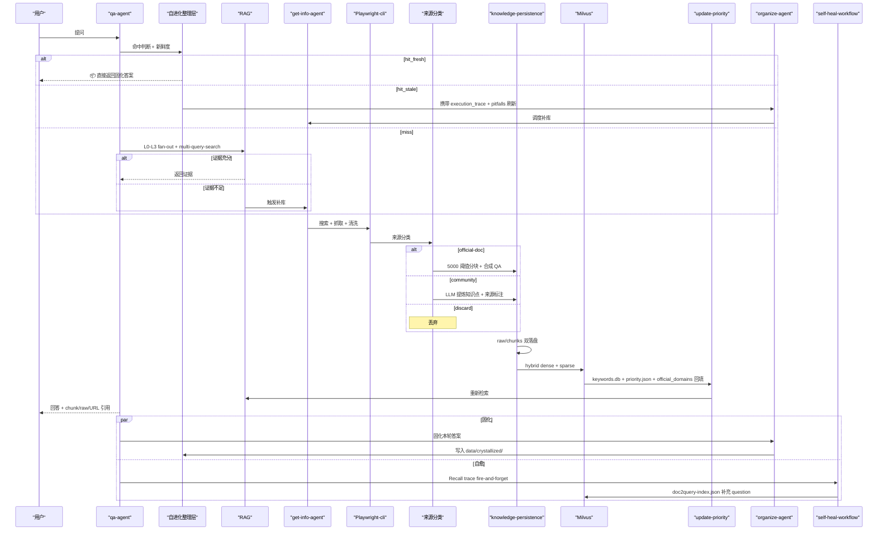
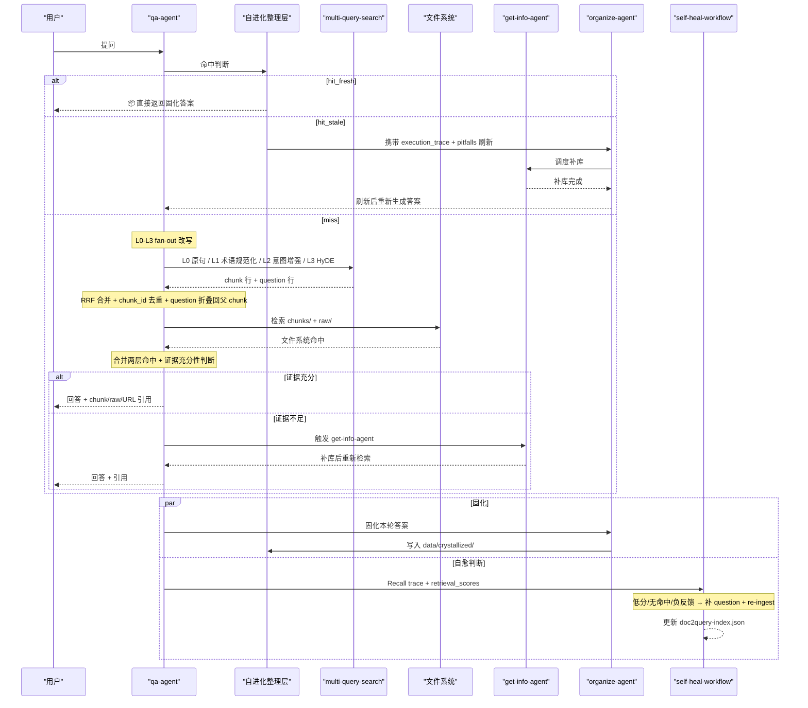
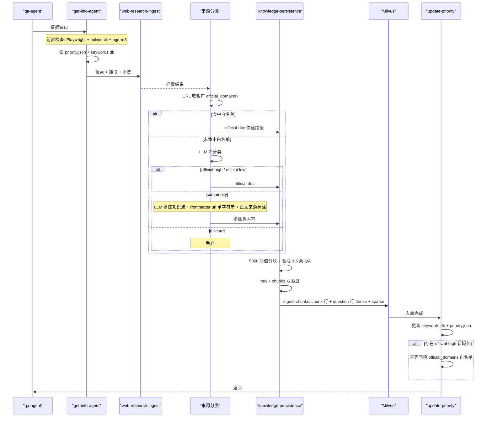

<div align="center">

# brain-base

*Claude Code Plugin 的知识库，让Claude Code 也能调用 RAG*

[简体中文](./README.md) | [English](./README_en.md)

[](https://claude.com/claude-code)
[](LICENSE)
[](https://milvus.io/)
[](https://www.npmjs.com/package/@playwright/cli)

> **Claude-Code-Agent-Plugin** | **QA First** | **Playwright-cli Ingest** | **Milvus RAG** | **MIT License**

</div>

---

## 痛点

你是否遇到过这些问题？

| 场景 | 结果 |
|------|------|
| 问答系统只会“即时回答”，不会长期沉淀 | 同样的问题反复查、反复答，知识无法复用 |
| 只靠向量库，不保留原始文档 | 出现争议时无法审计来源和上下文 |
| 一有新问题就直接联网抓取 | 成本高、慢，而且容易污染知识库 |
| 抓取工具混用、调用不一致 | 流程不可维护，排障困难 |
| RAG 每次问答都要重跑检索与综合，不积累 | 相似问题答过一遍还要重跑全链路，费时又费 token |
| 手头的论文 / PDF / Word / LaTeX 无法直接入库 | 知识库只能等联网补库，我自己的文档沉不进去 |

**brain-base** 的核心不是“再加一个检索脚本”，而是做一个可持续运行、自进化的知识闭环：

1. `qa-agent` 先查自进化整理层的固化答案，命中且新鲜直接返回。
2. 未命中再走本地 RAG 检索，再决定是否补库。
3. `get-info-agent` 只在证据不足时触发外部抓取。
4. 外部资料必须同时落到 `raw + chunks + Milvus + keywords.db`。
5. `playwright-cli` 统一作为外部网页抓取入口。
6. 一次满意问答完成后，`organize-agent` 把答案固化到自进化整理层，下次相似问题短路返回。

---

## 核心思想

本项目坚持三条主线：

1. 回答必须可追溯：答案要能回到 chunk、raw、来源 URL。
2. 知识必须可演进：每次补库都能被后续检索复用。
3. 结果必须可积累：成功回答过的问题应固化下来，相似问题不再重跑 RAG 链路。

本项目采用 [Karpathy LLM Wiki](https://gist.github.com/karpathy/442a6bf555914893e9891c11519de94f) 模式下的**三层架构**：

| 层 | 负责写入 | 作用 |
|---|---|---|
| **原始层** (`data/docs/raw/` + `data/docs/chunks/` + Milvus) | `get-info-agent`（联网补库）/ `upload-agent`（本地文档上传） | 不可变的原始证据，两条并列入口写入，只补库/修复，不改动 |
| **自进化整理层** (`data/crystallized/`) | `organize-agent` | LLM 整理的固化答案，相似问题短路返回 |
| **Schema 层** (`agents/` + `skills/`) | 用户 + 作者 | 控制系统行为的规则文件 |



---

## 核心能力

- **QA Agent**：先查自进化整理层的固化答案，未命中再对用户问题做 L0〜L3 fan-out 改写（原句 / 规范化 / 意图增强 / HyDE）并检索本地知识库，再决定是否补库。
- **Organize Agent （自进化整理层 / 固化层）**：对标 Karpathy LLM Wiki 模式。一次满意问答完成后，把答案、执行路径、遇到的坑固化为 Crystallized Skill；命中且新鲜 → 直接返回；命中但过期 → 携带原执行路径与坑指导 get-info-agent 精准刷新。
- **Get-Info Agent**：外部补库入口。作为调度器，基于站点优先级组织 **Playwright-cli** 抓取、清洗、分块、合成 QA 生成和落盘。
- **Upload Agent**：用户本地文档入库入口（与 Get-Info Agent 平行）。接收 PDF / Word / PPT / Excel / LaTeX / TXT / MD / 图片，通过 **MinerU 3.x + pandoc** 统一转换为 Markdown 后复用下游 `knowledge-persistence` 管道一致分块与入库。
- **Playwright-cli**：直接使用官方 `playwright-cli` 命令，遵循官方仓库推荐的安装与调用方式。
- **Milvus hybrid 索引（默认 bge-m3）**：dense + sparse 双路召回，支持 chunk 行 + 合成 question 行（doc2query）。
- **Question 自愈机制**：qa-agent 在回答后记录 recall trace；低分命中、无命中或用户负反馈时，通过独立 `claude -p` 后台进程触发 `self-heal-workflow`，补充缺失维度的 question 并重新入库。
- **doc2query 权威索引**：`data/eval/doc2query-index.json` 是 questions 的权威来源；`ingest-chunks` 优先读取该索引，chunk frontmatter 作为 fallback。
- **召回评估与信源仲裁**：`eval-recall.py` 支持 recall@K、6 维度 question 覆盖率评估、反馈沉淀；`source-priority.py` 为 chunk 标注 `source_priority` 并检测潜在信源冲突。
- **5000 字符分块阈值**：短文档不再被切碎（≤ 5000 字符整篇 1 块）；长文档按 Markdown 语义边界切分。
- **multi-query-search**：把多条 query 变体一次性丢给 CLI，自动并发检索、RRF 合并、按 chunk_id 去重。
- **Skill 工作流**：使用生产级 workflow 约束 Query 改写、证据判断、抓取流程、持久化流程、固化层命中与刷新流程。
- **动态站点优先级**：根据真实命中结果更新 `priority.json` 与 `keywords.db`。
- **非官方来源内容提炼**：博客、教程、问答帖等不整篇入库，由 LLM 提炼有用知识点后重组为带 `> 来源: <url>` 溯源标注的文档，每个 URL 独立成文（frontmatter `url` 单字符串 + 正文标注），grep 可查，无需额外数据库。
- **官方域名自学习白名单**：`priority.json.official_domains` 作为分类快速通道；LLM 高置信度判为官方的新域名由 `update-priority` 幂等回填，越用越准。

---

## 工作流概览

### QA 流程

1. 接收用户问题。
2. **步骤 0：自进化整理层命中判断**（固化层短路）：
   - `hit_fresh` → 直接返回固化答案，在回答开头标 `> 📦 来自自进化整理层固化答案...`
   - `hit_stale` → 委托 `organize-agent` 携带 `execution_trace` 与 `pitfalls` 调度 get-info-agent 刷新，然后重新生成答案
   - `miss` / `degraded` → 继续走以下 RAG 流程
3. 做 L0〜L3 fan-out 改写，产出 4〜6 条查询变体：
   - **L0** 用户原句
   - **L1** 术语规范化（缩写展开 / 中英别名 / 标准产品名）
   - **L2** 意图增强（动作词 / 步骤词 / 版本词 / 时间词）
   - **L3** HyDE 假答（虚构一段"理想答案的开头"再当查询用）
4. 优先检索本地知识：
   - 先查 `data/docs/chunks/`
   - 再查 `data/docs/raw/`
   - 再调用 `python bin/milvus-cli.py multi-query-search` 把所有变体丢进去做并发检索 + RRF 合并 + 按 `chunk_id` 去重（合成 question 行自动折叠回父 chunk）
5. 把文件系统命中与 multi-query-search 结果做最终合并，优先保留两层都命中的 chunk。
6. 判断证据是否充分、是否过时。
7. 只有当本地证据不足且明确需要新增外部知识时，才触发 `get-info-agent`。
8. 基于证据回答给用户。
9. **步骤 9：Recall trace + 自愈触发判断**——记录 `question / chunk_ids / doc_ids / retrieval_scores / answer_summary / session_id`；低分或负反馈时写入 `data/eval/self-heal-pending/` 并 fire-and-forget 触发 `self-heal-workflow`。
10. **步骤 10：委托 `organize-agent` 固化本轮答案**——满足固化条件时异步写入 `data/crystallized/`，下次相似问题短路返回。



### Get-Info 流程

1. 接收来自 `qa-agent` 的问题、查询变体和证据缺口。
2. 先做前置检查（Playwright-cli、`milvus-cli`、本地 bge-m3 模型可用性）。
3. 读取 `data/priority.json` 和 `data/keywords.db`。
4. 调用 `get-info-workflow` 编排子流程。
5. 调用 `playwright-cli-ops` 与 `web-research-ingest` 执行搜索、抓取和初步清洗。
6. **来源分类与内容提炼**：按「白名单 + LLM」两级判定文档属于 `official-doc` / `community` / `discard`；`community` 来源进入提炼流程，按知识点重组为新 Markdown，每个知识点附 `> 来源: <url>` 标注；`discard` 直接丢弃。
7. 调用 `knowledge-persistence` 保存 raw Markdown、按 5000 字符阈值规则做 LLM 分块。
8. **对每个 chunk 调用 LLM 生成 3〜5 条合成 QA 问题**，写入 chunk frontmatter 的 `questions: [...]`。
9. 以 chunk 为单位写入 Milvus（`ingest-chunks` 同时写 chunk 行与 question 行，hybrid 模式下写 dense + sparse）。
10. 更新 `keywords.db` 与 `priority.json`（`update-priority` 同时幂等回填 LLM 高置信度判为官方的新域名到 `official_domains` 白名单）。



---

## 持久化设计

### 为什么同时保留 raw 和 chunks

这个项目不是只做向量库。文件系统也是一等存储层。

1. `raw` 保留完整清洗后的 Markdown，适合审计、复核、保留完整上下文。
2. `chunks` 保留可 grep、可 RAG 的主题化片段，适合精确检索与引用。
3. Milvus 只负责存储与检索，不负责替你凭空生成真实 embedding。

### 分块原则（带 5000 字符硬阈值）

分块由 Claude Code 或 Codex 模型主导，不采用复杂本地分块系统。模型分块时**必须遵守**以下硬约束：

1. **正文 ≤ 5000 字符 → 整篇直接 1 个 chunk，不切。** 这是为了避免短 MD 被无谓地切成多块。
2. **正文 > 5000 字符 → 按 Markdown 语义边界切**，每块上限 5000 字符，目标 2000〜5000 字符/块。
3. 优先按 H2/H3 标题层级切分；其次按步骤组、FAQ 问答对切分。
4. **不得在代码块、表格、命令示例、列表中间硬切**。
5. 单个 chunk 保持主题完整，便于 Grep 和 RAG。
6. 必要时允许 ≤ 200 字符的轻度重叠，但避免重复污染。
7. 极端退化：单一语义块本身 > 5000 字符且内部无安全切点（如超长代码块），才允许字符硬切并标记 `truncated: true`。

### chunk 的目标

一个高质量 chunk 必须同时满足：

1. 单独拿出来也能看懂主要主题。
2. 保留标题路径、摘要、关键词、`questions` 合成问题列表，便于 Grep + 向量化双层召回。
3. 能回溯到 raw 文档和原始 URL。
4. 足够短，避免混入多个无关主题；又足够完整，不至于丢上下文。

### 合成 QA 索引（doc2query）

每个 chunk 落盘前，由 LLM 生成 3〜5 条用户口吻的合成问题，写入 frontmatter；同时，`data/eval/doc2query-index.json` 作为 questions 的权威索引，供自愈流程和重新入库复用：

```yaml
questions: ["如何创建 Claude Code subagent?", "subagent 的 frontmatter 必填字段?", "subagent 与 plugin 的关系?"]
```

`bin/milvus-cli.py ingest-chunks` 会优先从 `doc2query-index.json` 读取 questions；如果索引没有对应 `chunk_id`，再回退到 chunk frontmatter。每个问题会被独立 embedding 入库（行类型 `kind=question`，`chunk_id` 指向父 chunk）。检索时这些 question 行会和正文 chunk 行一起参与 RRF，最后按 `chunk_id` 去重，**显著降低用户口语 query 与文档术语之间的语义鸿沟**。

自愈流程只补 questions，不改 chunk 正文：低分命中或用户负反馈 → 写入 `data/eval/self-heal-pending/` → 独立 `claude -p` 触发 `self-heal-workflow` → 更新 `doc2query-index.json` → `ingest-chunks --replace-docs` 重新写入受影响文档。

---

## Milvus 与向量化边界

这是当前项目必须遵守的边界：

1. **Milvus 是向量数据库，不是通用 embedding 生成器。**
2. 稠密向量必须来自能返回 embedding 的 provider。
3. provider 可以是本地 embedding 模型，也可以是在线 embedding API。
4. 只能返回文本、不能返回 embedding 的通用大模型，不能直接替代向量化阶段。
5. 稀疏 / BM25 检索和 dense 检索都应是正式设计的一部分，不能再用伪向量占位。
6. **当前默认 provider 为 `BAAI/bge-m3`**（hybrid，dense 1024 维 + sparse），首次启动需要下载约 1.4 GB 模型。CPU 可跑但向量化较慢；有 GPU 时设 `KB_EMBEDDING_DEVICE=cuda` 显著加速。如需轻量回退到 384 维 dense-only，设 `KB_EMBEDDING_PROVIDER=sentence-transformer`。

---

## Agent 与 Skill 分层

### Agent

1. `qa-agent`：主问答 Agent。查固化层 → 查 RAG → 必要时触发 get-info-agent 补库 → 回答 → 输出 recall trace → 必要时触发 self-heal-workflow → 触发 organize-agent 固化。
2. `organize-agent`：**自进化整理层调度 Agent**。负责固化、刷新、反馈处理、健康检查；**不改动原始层**，刷新时携带原 `execution_trace` + `pitfalls` 调 get-info-agent。
3. `get-info-agent`：外部补库 Agent。调度 Playwright-cli 抓取、清洗、分块、落盘。
4. `upload-agent`：用户本地文档上传 Agent（与 `get-info-agent` 平行，两条入口在 `knowledge-persistence` 层汇合）。接收本地文件 → `doc-converter` 完成 storage（原始文件归档 + raw Markdown 落盘 + 图片资源保留）→ 再交给 `knowledge-persistence` 做 Agent/LLM 语义分块与统一入库。

### Skill

QA、Get-Info、Organize、Upload 四个 agent 调度以下 skills：

1. `qa-workflow`：固化层命中判断（步骤 0）、L0〜L3 fan-out 改写、multi-query-search 调用、证据充分性判断、Recall trace 与自愈触发（步骤 9）、触发 organize-agent 固化（步骤 10）。
2. `crystallize-workflow`：固化层命中判断 / 新鲜度判断 / 写入 / 刷新；`data/crystallized/index.json` 与 `<skill_id>.md` 的唤入唤出语义。
3. `crystallize-lint`：固化层健康检查，周期清理 rejected / 垃圾条目、检测孤儿文件与损坏文件。
4. `playwright-cli-ops`：稳定调用 Playwright-cli。
5. `web-research-ingest`：搜索、抓取、清洗网页内容。
6. `knowledge-persistence`：5000 字符阈值分块、合成 QA 生成、raw/chunks 落盘、Milvus hybrid 持久化。**get-info 和 upload 两条入口的共同下游。**
7. `get-info-workflow`：编排外部补库子 skill 的执行顺序与失败策略。
8. `upload-ingest`：用户文档入库 workflow，与 `get-info-workflow` 平行；先调度 `doc-converter` 完成 upload → storage，再把 raw 文档交给 `knowledge-persistence`。
9. `self-heal-workflow`：召回自愈后台流程。读取 recall trace / 用户反馈，记录 feedback，按 6 维度补 questions，写入 `doc2query-index.json` 并重新入库。
10. `update-priority`：更新关键词和优先级状态（仅 get-info 路径调用；upload 路径无 URL/站点，跳过）。
11. `brain-base-skill`：**外部 Agent 调用说明书**——部署在 `~/.claude/skills` 或 `~/.codex/skills`，教其他 Agent 如何通过 `claude -p ... --plugin-dir ... --agent brain-base:qa-agent|upload-agent --dangerously-skip-permissions` 调起知识库的两条入口。

---

## 外部 Agent 调用 brain-base

brain-base 不仅能在 Claude Code 中作为 Plugin 使用，任何安装了 Claude Code 的 系统 都可以通过命令行调用它。

### 调用方式对比

两条并列入口（根据意图选择 agent）：

| 场景 | 调用命令 |
|------|----------|
| **问答 / 联网补库** | `claude -p "问题" --plugin-dir <PATH> --agent brain-base:qa-agent --dangerously-skip-permissions` |
| **上传本地文档入库** | `claude -p "把 /path/to/file.pdf 入库" --plugin-dir <PATH> --agent brain-base:upload-agent --dangerously-skip-permissions` |

部署形态（与上面两个 agent 独立）：

| 场景 | 配置方式 |
|------|----------|
| **Plugin 模式** | brain-base 安装在 `~/.claude/plugins/` |
| **项目级模式** | brain-base 作为普通项目存放，通过 `--plugin-dir` 指向 |

### 项目级调用步骤

当 brain-base 作为项目级项目时，其他项目想要调用它：

**1. 部署 brain-base-skill**

将 `skills/brain-base-skill/` 复制到调用方机器的 `~/.claude/skills/` 或 `~/.codex/skills/`：

```bash
cp -r skills/brain-base-skill ~/.claude/skills/
```

**2. 确定 brain-base 路径**

调用方需要知道 brain-base 的绝对路径。三种方案：

- **环境变量（推荐）**：在 `.env` 中设置 `BRAIN_BASE_PATH=/absolute/path/to/brain-base`
- **相对路径**：如果调用方与 brain-base 有固定目录关系（如 `~/projects/brain-base` 和 `~/projects/caller-project`）
- **Claude Code 查找**：询问 Claude Code "brain-base 项目在哪里"

**3. 调用示例**

问答示例：

```bash
export BRAIN_BASE_PATH="/home/user/projects/brain-base"

claude -p "Claude Code subagent 怎么配置？" \
  --plugin-dir "$BRAIN_BASE_PATH" \
  --agent brain-base:qa-agent \
  --dangerously-skip-permissions
```

上传本地文档示例：

```bash
claude -p "把 以下文件入库：/home/user/papers/knowledge-distillation.pdf" \
  --plugin-dir "$BRAIN_BASE_PATH" \
  --agent brain-base:upload-agent \
  --dangerously-skip-permissions
```

更多 prompt 模板与批量调用见 `skills/brain-base-skill/SKILL.md` 中的“upload-agent 的 prompt”小节。

### 为什么必须 `--dangerously-skip-permissions`

qa-agent 执行时会触发 `get-info-agent` 进行网页抓取、文件写入等操作。如果不带此参数，Claude Code 会在每一步弹出权限确认对话框，导致：

- 作为子进程被调用时无人响应 → 进程挂起
- 自动化流程被频繁打断

因此从外部 Agent 调用时必须跳过权限确认。

### 固化反馈

问答完成后，需要发送反馈确认固化：

```bash
claude -p -c "用户未否定，确认固化上一轮答案" \
  --plugin-dir "$BRAIN_BASE_PATH" \
  --agent brain-base:qa-agent \
  --dangerously-skip-permissions
```

更多细节参见 `skills/brain-base-skill/SKILL.md`。

---

## 快速启动

以下命令默认在 `brain-base` 仓库根目录执行。如果你当前不在该目录，请先进入该目录；后文 `--plugin-dir .` 中的 `.` 都指当前目录。

如果你希望按“可长期运行、全权限自动化、后台补库策略”来使用，请看完整手册：

- [OPERATIONS_MANUAL.md](./md/OPERATIONS_MANUAL.md) | [English](./md/OPERATIONS_MANUAL_en.md)

### 1. 启动 Milvus

```bash
docker compose up -d
```

验证 Milvus：

```bash
curl http://localhost:9091/healthz
```

### 2. 安装 Python 依赖

以下命令会安装到你当前选择的 Python 环境中。若你使用虚拟环境，请先激活虚拟环境，再执行安装。

**方式 A：一次性装全**（推荐）

```bash
python -m pip install -r requirements.txt
```

**方式 B：按能力分步装**

```bash
# 1. 问答 / 检索 / 入库（get-info + upload 两条入口共享）
python -m pip install -U "pymilvus[model]" sentence-transformers FlagEmbedding

# 2. 用户本地文档上传入库（upload-agent 专用；PDF/DOCX/PPTX/XLSX/图片）
python -m pip install -U 'mineru[pipeline]>=3.1,<4.0'
```

说明：

1. `pymilvus[model]` 提供向量化辅助函数（含 BGE-M3 / SentenceTransformer / OpenAI 三类 wrapper）。
2. `sentence-transformers` 是 BGE-M3 与 sentence-transformer 模型的底层依赖。
3. `FlagEmbedding` 是 BAAI/bge-m3 的官方推理库；首次调用会自动下载约 1.4 GB 模型到 `~/.cache/huggingface/`。
4. `mineru[pipeline]` 是 upload-agent 调用的 **MinerU 3.x** 文档解析后端（允许 Apache 2.0 base 许可、CJK 强）；首次会自动下载约 2 GB 模型。若不打算上传本地 PDF/DOCX 等，可跳过。
5. **可选系统依赖 `pandoc`**：仅在上传 `.tex` 文档时需要，参考 https://pandoc.org/installing.html。
6. **（强烈建议，GPU 加速）**：MinerU 默认跑本地 torch。CPU 推理每页 PDF 约 5 分钟；有 NVIDIA GPU 时换成 CUDA 版 torch 后约 7 秒/页（45× 提速，RTX 4060 Ti 实测）。
   ```bash
   # 先按上面装完 MinerU，然后检测 CUDA 是否可用
   python -c "import torch; print(torch.cuda.is_available())"
   # 若 False 且有 N 卡（nvidia-smi 能看到显卡信息），替换成 CUDA 版：
   python -m pip uninstall -y torch torchvision
   python -m pip install torch torchvision --index-url https://download.pytorch.org/whl/cu124
   ```
   **注意**：国内 pip 镜像（USTC / 阿里 / 清华等）通常只同步 CPU 版 torch，必须用 PyTorch 官方 index `https://download.pytorch.org/whl/cu124` 才能拿到 CUDA wheel。CUDA 版本选择：`nvidia-smi` 右上角的 CUDA Version ≥ 12.4 即可用 `cu124`，更老卡用 `cu121` / `cu118`。

### 3. 确认 milvus-cli 可用

1. 先查看当前 Milvus / provider 配置：

```bash
python bin/milvus-cli.py inspect-config
```

2. 通过预检命令确认本地向量化能力可用：

```bash
python bin/milvus-cli.py check-runtime --require-local-model --smoke-test
```

### 4. 确认 Playwright-cli 可用（对 Agent 集成场景强制）

`get-info-agent` 的外部抓取链路依赖官方 **Playwright-cli**。调用约束是：优先 `playwright-cli`，其次 `npx --no-install playwright-cli`，不要静默替换成其他抓取器。

1. 安装官方 CLI：

```bash
npm install -g @playwright/cli@latest
```

这条命令会把 `playwright-cli` 安装到全局 Node 环境。

2. 如果要给 Claude Code、Codex、Cursor、Copilot 等 Agent 使用，按官方 README 安装 CLI skills（本项目视为必需步骤）：

```bash
playwright-cli install --skills
```

3. 验证命令：

```bash
playwright-cli --help
```

4. 如果你已经在当前项目里本地安装了 `@playwright/cli`，也可以使用：

```bash
npx --no-install playwright-cli --help
```

### 5. 启动 QA Agent

```bash
claude --plugin-dir . --agent brain-base:qa-agent
```

这里的 `.` 表示当前目录，因此这条命令要求你当前就在 `brain-base` 仓库根目录。如果你当前在它的父目录，请改用：

```bash
claude --plugin-dir ./brain-base --agent brain-base:qa-agent
```

#### 如果想完全离手操作

```bash
claude --plugin-dir . --agent brain-base:qa-agent --dangerously-skip-permissions
```

### 6. 如果你已安装并启用本插件，也可在 `.claude/settings.json` 中配置默认 agent

```json
{
  "$schema": "https://json.schemastore.org/claude-code-settings.json",
  "agent": "brain-base:qa-agent"
}
```

仅配置 `agent` 不会替代 `--plugin-dir .`。如果你是直接从当前仓库目录临时加载插件，仍需使用上一条命令启动。

### 7. 开始提问

本地知识问答：

```text
请告诉我 Claude Code 的 subagent 怎么创建？
```

强制补充外部资料：

```text
请先联网补充最新的 Claude Code 文档，再回答 subagent 怎么创建。
```

---

## 数据与配置

### `data/priority.json`

这个文件维护站点优先级、关键词和上次更新时间。

```json
{
  "version": "1.1.0",
  "update_interval_hours": 24,
  "last_update": "2026-04-12T00:00:00Z",
  "official_domains": [
    "docs.anthropic.com",
    "github.com/anthropics"
  ],
  "sites": {
    "anthropic": {
      "priority": 10,
      "keywords": ["claude-code", "subagent", "plugin"]
    }
  }
}
```

字段说明：

1. **`official_domains`**：官方域名白名单（可为空数组）。`get-info-workflow` 分类非官方/官方来源时先查询白名单，未命中时交 LLM 综合判断；LLM 高置信度判为官方的新域名由 `update-priority` 回填至此数组。仅作为分类加速通道，不是安全边界，用户可随时手动编辑。
2. **`sites.<site_id>.priority`**：站点优先级打分，数值越高检索越优先。
3. **`sites.<site_id>.keywords`**：站点关联关键词，用于关键词补强。

### `data/keywords.db`

记录关键词、站点、查询次数、最后查询时间。它不是替代 `priority.json`，而是为优先级更新提供事实依据。

表结构：

1. **`keywords`**：关键词热度记录（site_id, keyword, query_count, last_query_at）。

提炼来源 URL 不单独入表：它们作为文档元信息直接写在提炼文档的 chunk frontmatter `url` 字段（单个字符串，一个 URL = 一个文档）和正文 `> 来源: <url>` 标注中，溯源通过 grep 或读文件完成。

### 目录结构

```text
brain-base/
├── .mcp.json
├── requirements.txt               # Python 依赖：pymilvus[model] / FlagEmbedding / mineru[pipeline]
├── agents/
│   ├── qa-agent.md
│   ├── get-info-agent.md         # 外部补库入口
│   ├── upload-agent.md           # 本地文档上传入口（与 get-info-agent 平行）
│   └── organize-agent.md         # 自进化整理层调度 Agent
├── skills/
│   ├── qa-workflow/
│   ├── crystallize-workflow/     # 固化层命中判断 / 写入 / 刷新
│   ├── crystallize-lint/         # 固化层健康检查
│   ├── get-info-workflow/
│   ├── upload-ingest/            # 用户文档入库 workflow（与 get-info-workflow 平行）
│   ├── self-heal-workflow/        # 召回自愈 workflow（后台 claude -p 触发）
│   ├── playwright-cli-ops/
│   ├── web-research-ingest/
│   ├── knowledge-persistence/    # 两条入口的共同下游
│   ├── update-priority/
│   └── brain-base-skill/         # 外部 Agent 调用说明书（同时说明 qa-agent＋ upload-agent 两条入口）
├── bin/
│   ├── milvus-cli.py
│   ├── eval-recall.py             # recall@K、feedback、coverage、doc2query-index
│   ├── source-priority.py         # source_priority 标注与信源冲突检测
│   ├── doc-converter.py          # MinerU + pandoc + 原生 TXT/MD 统一转 Markdown
│   └── scheduler-cli.py
├── planning/                     # 项目收敛与改造计划留存
├── data/                         # 已 gitignore，运行时自动创建
│   ├── docs/
│   │   ├── raw/                  # 原始层——get-info-agent / upload-agent 写，LLM 只读
│   │   ├── chunks/               # 分块层——由 knowledge-persistence 写
│   │   └── uploads/              # 用户上传的原始文件归档（upload-agent 写）
│   ├── crystallized/             # 自进化整理层——由 organize-agent 写
│   │   ├── index.json            # 固化 skill 索引
│   │   └── <skill_id>.md         # 每条固化 skill 一个文件
│   ├── priority.json
│   ├── keywords.db
│   └── eval/
│       ├── doc2query-index.json   # questions 权威索引
│       ├── coverage-report.json   # 6 维度覆盖率报告
│       ├── feedback.db            # 用户反馈 SQLite
│       ├── results/               # recall 评估结果
│       └── self-heal-pending/     # 自愈信号文件
└── mcp/
    └── milvus-rag/
```

---
## CLI 工具

```bash
# 查看当前 Milvus/provider 配置
python bin/milvus-cli.py inspect-config

# 检查本地向量化模型与可向量化能力
python bin/milvus-cli.py check-runtime --require-local-model --smoke-test

# 把 chunk Markdown 入库到 Milvus（默认追加；hybrid 模式会自动写 dense + sparse；
# questions 优先来自 data/eval/doc2query-index.json，frontmatter 作为 fallback；
# 每条 question 都会作为独立行入库，kind=question）
python bin/milvus-cli.py ingest-chunks --chunk-pattern "data/docs/chunks/*.md"

# 覆盖重写某个文档（先删后写，谨慎）
python bin/milvus-cli.py ingest-chunks --chunk-pattern "data/docs/chunks/claude-code-agent-teams-2026-04-12-*.md" --replace-docs

# Dense 检索（单查询，旧式调用）
python bin/milvus-cli.py dense-search "搜索关键词"

# Hybrid 检索（单查询，bge-m3 dense+sparse）
python bin/milvus-cli.py hybrid-search "搜索关键词"

# 多查询 fan-out 检索（推荐主路径）
# 每个 --query 对应一条 L0/L1/L2/L3 改写；CLI 自动并发检索、RRF 合并、按 chunk_id 去重
python bin/milvus-cli.py multi-query-search \
  --query "claude code subagent 配置" \
  --query "Claude Code subagent configuration" \
  --query "如何创建 Claude Code subagent" \
  --query "Claude Code 的 subagent 通过 .claude/agents 下的 YAML 文件定义..." \
  --top-k-per-query 20 --final-k 10

# 构建召回评估集（从 chunk frontmatter questions 生成）
python bin/eval-recall.py build-queries --chunks-dir data/docs/chunks --output data/eval/queries.json

# 跑 Milvus+embedding 召回评估
python bin/eval-recall.py run --queries data/eval/queries.json --mode embedding --top-k 10

# 跑 brain-base 完整召回评估（grep + embedding）
python bin/eval-recall.py run --queries data/eval/queries.json --mode full --top-k 10

# 记录用户反馈，并将高评分反馈转成真实评估问题
python bin/eval-recall.py record-feedback --question "..." --rating 5 --type positive --chunk-ids "[\"chunk-id\"]" --doc-ids "[\"doc-id\"]"
python bin/eval-recall.py feedback-to-queries --output data/eval/queries-real.json

# 生成 6 维度 question 覆盖率报告
python bin/eval-recall.py coverage-check --chunks-dir data/docs/chunks --output data/eval/coverage-report.json

# 更新 doc2query 权威索引（自愈流程使用）
python bin/eval-recall.py update-doc2query-index --chunk-id "<chunk-id>" --questions "[\"问题1\", \"问题2\"]"

# 标注 source_priority 并检测信源冲突
python bin/source-priority.py add-priority --apply
python bin/source-priority.py detect-conflicts

# 检查是否到达优先级更新时间窗口
python bin/scheduler-cli.py --check

# 更新关键词
python bin/scheduler-cli.py --keyword "claude-code" --site anthropic
```

### 手动启动离线评估

这里的“离线”指的是：**不需要启动 `qa-agent`、`get-info-agent`、Playwright-cli，也不依赖联网抓取**。但 `run` 子命令仍然需要你本地的 **Milvus + embedding runtime** 可用。

最小操作顺序：

1. 先确认 Milvus 和本地向量化运行时可用：

```bash
python bin/milvus-cli.py inspect-config
python bin/milvus-cli.py check-runtime --require-local-model --smoke-test
```

2. 如果你还没有评估问题集，先从 `data/docs/chunks/` 里的 frontmatter `questions` 生成：

```bash
python bin/eval-recall.py build-queries --chunks-dir data/docs/chunks --output data/eval/queries.json
```

3. 手动跑 embedding-only 评估：

```bash
python bin/eval-recall.py run --queries data/eval/queries.json --mode embedding --top-k 10
```

4. 手动跑 full 评估（grep + embedding）：

```bash
python bin/eval-recall.py run --queries data/eval/queries.json --mode full --top-k 10
```

5. 如需比较两次评估结果：

```bash
python bin/eval-recall.py diff data/eval/results/<old>.json data/eval/results/<new>.json
```

补充说明：

- **`build-queries` / `diff` / `record-feedback` / `feedback-to-queries`** 可以脱离 Milvus 单独运行。
- **`run`** 会把结果写到 `data/eval/results/`，适合手动做基线对比。
- 当前基线是：`data/eval/queries.json` 共 81 条 synthetic query，`embedding` 与 `full` 两条路径的 Recall@1/3/5 均为 100%。

### Provider 切换与 collection 重建

切换 `KB_EMBEDDING_PROVIDER`（如 bge-m3 ↔ sentence-transformer）会改变 dense 维度与 schema：

1. CLI 在 dim 不匹配或 schema 不匹配时会 fail-fast，不会静默写脏数据。
2. 切换前必须 drop 旧 collection 再重新入库；最简单的做法是删掉 Milvus 里的 collection 再跑 `ingest-chunks`，CLI 会按当前 provider 重建 schema。
3. 默认 provider 已是 `bge-m3`（hybrid，dense 1024 维 + sparse）。若需回退到 sentence-transformer，设 `KB_EMBEDDING_PROVIDER=sentence-transformer`，dense 变为 384 维，sparse 字段为空（dense-only 检索）。

---

## 数据存储警告

> 此 Plugin 会持续把知识写入 `data/` 目录。随着使用时间增长，数据量会不断增加。
>
> 强烈建议把 Plugin 安装在**项目级目录**，不要直接长期堆到用户级全局配置目录。

---

## Milvus CLI
  
 本项目直接通过 `bin/milvus-cli.py` 与 Milvus 交互，不再通过 MCP 暴露 Milvus 接口。
  
 常用命令包括：
  
 ```bash
 python bin/milvus-cli.py inspect-config
 python bin/milvus-cli.py check-runtime --require-local-model --smoke-test
 python bin/milvus-cli.py ingest-chunks --chunk-pattern "data/docs/chunks/*.md"
 python bin/milvus-cli.py multi-query-search --query "..."
 ```
  
 Agent / Skill 文档中提到的 Milvus 检索、健康检查和入库，实际都应落到这些 CLI 命令上。
 
 ---
 
 ## 当前实现状态

本仓库当前已完成：

1. `skills` 与 `agents` 全部提升为生产级工作流定义。
2. 明确 QA、Get-Info、Organize、Upload 四类 Agent/Workflow 的协作边界。
3. raw/chunks 双副本持久化 + 5000 字符阈值分块规则。
4. 默认 BGE-M3 hybrid 入库链路（dense + sparse），`ingest-chunks` 端到端可用。
5. 合成 QA（doc2query）索引层：每 chunk 3〜5 条问题独立向量化入库。
6. multi-query-search CLI：L0〜L3 fan-out + RRF 合并 + 按 chunk_id 去重。
7. 非官方来源内容提炼与溯源标注：白名单快速通道 + LLM 四分类判定 + `update-priority` 自学习回填 `official_domains`，溯源信息全部在提炼文档的 `url` frontmatter 字段（一个 URL = 一个文档）和正文 `> 来源: <url>` 标注中。
8. **自进化整理层（Crystallized Skill Layer）**：`organize-agent` + `crystallize-workflow` + `crystallize-lint` + `bin/crystallize-cli.py` 维护 hot/cold 两层固化答案；低价值问题跳过，高价值问题进入 hot，中等价值进入 cold 观察区；冷藏答案达到命中阈值可自动或手动晋升。
9. **用户本地文档上传入库（Upload Ingest 路径）**：`upload-agent` + `upload-ingest` + `bin/doc-converter.py` 与 `get-info-*` 并列，在 `knowledge-persistence` 层汇合；支持 PDF / DOCX / PPTX / XLSX / LaTeX / TXT / MD / PNG / JPG / PY / TS / GO / RS。frontmatter 类型 `source_type: user-upload`，通过 Milvus `enable_dynamic_field=True` 零 schema 迁移。
10. **证据可信度与时效性标注**：qa-workflow 强制输出来源与时效证据表，按 `source_type` 与 `age_days` 分 Tier-1/2/3；>90 天提示时效风险，>180 天建议刷新证据。
11. **入库内容哈希去重**：raw Markdown body 计算 `content_sha256`，入库前用 `hash-lookup` 查重；历史文档已通过 `backfill-hashes` 补齐；`find-duplicates` 可做定期体检。
12. **离线 smoke test 框架**：`pytest tests/smoke -q` 覆盖 crystallize-cli、milvus-cli 文件系统命令、P2-1 hash 去重三件套、P2-3 eval-recall CLI，共 55 个测试；默认跳过需 Milvus 的集成测试。
13. **进度与验收文档**：`BRAIN_BASE_CHARTER.md` 保存设计宪章，`BRAIN_BASE_PROGRESS.md` 用表格追踪痛点完成度与剩余路线图。
14. **召回评估基线与反馈闭环（P2-3 Phase 1/2/3）**：`bin/eval-recall.py` 可从 chunk frontmatter questions 构建 `data/eval/queries.json`，并分别评估 embedding-only 与 full（grep+embedding）召回；当前 81 条合成问题的两条路径均达到 Recall@1/3/5 = 100%。同时支持 `record-feedback` 写入 `data/eval/feedback.db`，再用 `feedback-to-queries` 生成真实用户 query 评估集。

当前高优先级痛点（P0/P1）已完成，P2 已完成内容哈希去重与召回评估基线。后续扩展建议按真实使用反馈排序：

1. 批量上传进度 + 断点续传（P2-2）：当开始一次性导入大量 PDF/论文时再做。
2. 检索质量评估扩展（P2-3 后续）：接入 qa-agent 自动记录反馈、加入 hard negative 与 doc2query 自愈。
3. 固化反馈自动闭环（T4）：减少 `pending` 到 `confirmed` 对用户手动反馈的依赖。
4. 数据完整导出（P3-3）：当知识库开始跨机器迁移或团队共享时再做。
5. 固化层 embedding 索引（P3-1）：当固化 skill 数量超过 200 条后再做。
