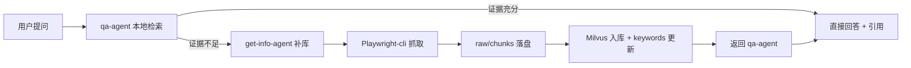

<div align="center">

# knowledge-base

*Claude Code Plugin 的知识库，让Claude Code 也能调用 RAG*

[](https://claude.com/claude-code)
[](LICENSE)
[](https://milvus.io/)
[](https://www.npmjs.com/package/@playwright/cli)

> **Claude-Code-Agent-Plugin** | **QA First** | **Playwright-cli Ingest** | **Milvus RAG** | **MIT License**

</div>

---

## 痛点

你是否遇到过这些问题？

| 场景 | 结果 |
|------|------|
| 问答系统只会“即时回答”，不会长期沉淀 | 同样的问题反复查、反复答，知识无法复用 |
| 只靠向量库，不保留原始文档 | 出现争议时无法审计来源和上下文 |
| 一有新问题就直接联网抓取 | 成本高、慢，而且容易污染知识库 |
| 抓取工具混用、调用不一致 | 流程不可维护，排障困难 |

**knowledge-base** 的核心不是“再加一个检索脚本”，而是做一个可持续运行的知识闭环：

1. `qa-agent` 先本地检索，再决定是否补库。
2. `get-info-agent` 只在证据不足时触发外部抓取。
3. 外部资料必须同时落到 `raw + chunks + Milvus + keywords.db`。
4. `playwright-cli` 统一作为外部网页抓取入口。

---

## 核心思想

本项目坚持两条主线：

1. 回答必须可追溯：答案要能回到 chunk、raw、来源 URL。
2. 知识必须可演进：每次补库都能被后续检索复用。



---

## 核心能力

- **QA Agent**：对用户问题做 Query 改写，默认只检索本地知识库，再决定是否补库。
- **Get-Info Agent**：作为调度器，基于站点优先级组织 **Playwright-cli** 抓取、清洗、分块和落盘。
- **Playwright-cli**：直接使用官方 `playwright-cli` 命令，遵循官方仓库推荐的安装与调用方式。
- **Milvus provider 架构**：Milvus 负责存储和检索，真实 embedding 由本地模型或在线 embedding API 提供。
- **Skill 工作流**：使用生产级 workflow 约束 Query 改写、证据判断、抓取流程、持久化流程。
- **Milvus RAG**：在文件系统检索不足时提供语义检索能力，并与 Grep 结果做 RRF 合并。
- **动态站点优先级**：根据真实命中结果更新 `priority.json` 与 `keywords.db`。

---

## 工作流概览

### QA 流程

1. 接收用户问题。
2. 做 Query 改写：
   - 术语规范化
   - 中英文别名展开
   - 缩写扩展
   - 版本/时间词补充
3. 优先检索本地知识：
   - 先查 `data/docs/chunks/`
   - 再查 `data/docs/raw/`
   - 再查 Milvus
4. 对 Grep 与 Milvus 做 RRF 合并。
5. 判断证据是否充分、是否过时。
6. 只有当本地证据不足且明确需要新增外部知识时，才触发 `get-info-agent`。

### Get-Info 流程

1. 接收来自 `qa-agent` 的问题、查询变体和证据缺口。
2. 先做前置检查（Playwright-cli、Milvus MCP、本地向量化可用性）。
3. 读取 `data/priority.json` 和 `data/keywords.db`。
4. 调用 `get-info-workflow` 编排子流程。
5. 调用 `playwright-cli-ops` 与 `web-research-ingest` 执行搜索、抓取和初步清洗。
6. 调用 `knowledge-persistence` 保存 raw Markdown、做 LLM 分块、保存 chunk Markdown。
7. 以 chunk 为单位写入 Milvus。
8. 更新 `keywords.db` 与 `priority.json`。

---

## 持久化设计

### 为什么同时保留 raw 和 chunks

这个项目不是只做向量库。文件系统也是一等存储层。

1. `raw` 保留完整清洗后的 Markdown，适合审计、复核、保留完整上下文。
2. `chunks` 保留可 grep、可 RAG 的主题化片段，适合精确检索与引用。
3. Milvus 只负责存储与检索，不负责替你凭空生成真实 embedding。

### 分块原则

分块由 Claude Code 或 Codex 模型主导，不采用复杂本地分块系统。模型分块时应遵守：

1. 优先按 Markdown 标题层级切分。
2. 对步骤型内容按阶段或步骤组切分。
3. 对 FAQ 内容按问答对切分。
4. 不在代码块、表格、命令示例中间硬切。
5. 单个 chunk 保持主题完整，便于 Grep 和 RAG。
6. 必要时允许轻度重叠，但避免重复污染。

### chunk 的目标

一个高质量 chunk 必须同时满足：

1. 单独拿出来也能看懂主要主题。
2. 保留标题路径、摘要、关键词，便于 Grep。
3. 能回溯到 raw 文档和原始 URL。
4. 足够短，避免混入多个无关主题；又足够完整，不至于丢上下文。

---

## Milvus 与向量化边界

这是当前项目必须遵守的边界：

1. **Milvus 是向量数据库，不是通用 embedding 生成器。**
2. 稠密向量必须来自能返回 embedding 的 provider。
3. provider 可以是本地 embedding 模型，也可以是在线 embedding API。
4. 只能返回文本、不能返回 embedding 的通用大模型，不能直接替代向量化阶段。
5. 稀疏 / BM25 检索和 dense 检索都应是正式设计的一部分，不能再用伪向量占位。

---

## Skill 分层

`get-info-agent` 现在不是一个大而全的提示词，而是调度以下 skills：

1. `playwright-cli-ops`：稳定调用 Playwright-cli。
2. `web-research-ingest`：搜索、抓取、清洗网页内容。
3. `knowledge-persistence`：LLM 分块、raw/chunks 落盘、Milvus 持久化。
4. `update-priority`：更新关键词和优先级状态。

---

## 快速启动（已合并 QUICKSTART）

以下命令默认在 `knowledge-base` 仓库根目录执行。如果你当前不在该目录，请先进入该目录；后文 `--plugin-dir .` 中的 `.` 都指当前目录。

如果你希望按“可长期运行、全权限自动化、后台补库策略”来使用，请看完整手册：

- [OPERATIONS_MANUAL.md](./OPERATIONS_MANUAL.md)

### 1. 启动 Milvus

```bash
docker compose up -d
```

验证 Milvus：

```bash
curl http://localhost:9091/healthz
```

### 2. 安装 Python 依赖

以下命令会安装到你当前选择的 Python 环境中。若你使用虚拟环境，请先激活虚拟环境，再执行安装。

```bash
python -m pip install -U "pymilvus[model]" sentence-transformers
```

### 3. 准备官方 Milvus MCP Server

1. 安装 `uv`（官方推荐运行方式）。
2. 克隆官方仓库到本项目约定路径：

```bash
git clone https://github.com/zilliztech/mcp-server-milvus.git ./mcp/mcp-server-milvus
```

3. 项目根目录已提供 `.mcp.json`，会按官方 README 推荐的 stdio 方式启动 Milvus MCP。
4. 通过预检命令确认本地向量化能力可用：

```bash
python bin/milvus-cli.py check-runtime --require-local-model --smoke-test
```

### 4. 确认 Playwright-cli 可用（对 Agent 集成场景强制）

`get-info-agent` 的外部抓取链路依赖官方 **Playwright-cli**。调用约束是：优先 `playwright-cli`，其次 `npx --no-install playwright-cli`，不要静默替换成其他抓取器。

1. 安装官方 CLI：

```bash
npm install -g @playwright/cli@latest
```

这条命令会把 `playwright-cli` 安装到全局 Node 环境。

2. 如果要给 Claude Code、Codex、Cursor、Copilot 等 Agent 使用，按官方 README 安装 CLI skills（本项目视为必需步骤）：

```bash
playwright-cli install --skills
```

3. 验证命令：

```bash
playwright-cli --help
```

4. 如果你已经在当前项目里本地安装了 `@playwright/cli`，也可以使用：

```bash
npx --no-install playwright-cli --help
```

### 5. 启动 QA Agent

```bash
claude --plugin-dir . --agent knowledge-base:qa-agent
```

这里的 `.` 表示当前目录，因此这条命令要求你当前就在 `knowledge-base` 仓库根目录。如果你当前在它的父目录，请改用：

```bash
claude --plugin-dir ./knowledge-base --agent knowledge-base:qa-agent
```

### 6. 如果你已安装并启用本插件，也可在 `.claude/settings.json` 中配置默认 agent

```json
{
  "$schema": "https://json.schemastore.org/claude-code-settings.json",
  "agent": "knowledge-base:qa-agent"
}
```

仅配置 `agent` 不会替代 `--plugin-dir .`。如果你是直接从当前仓库目录临时加载插件，仍需使用上一条命令启动。

### 7. 开始提问

本地知识问答：

```text
请告诉我 Claude Code 的 subagent 怎么创建？
```

强制补充外部资料：

```text
请先联网补充最新的 Claude Code 文档，再回答 subagent 怎么创建。
```

---

## 数据与配置

### `data/priority.json`

这个文件维护站点优先级、关键词和上次更新时间。

```json
{
  "version": "1.0.0",
  "update_interval_hours": 24,
  "last_update": "2026-04-12T00:00:00Z",
  "sites": {
    "anthropic": {
      "priority": 10,
      "keywords": ["claude-code", "subagent", "plugin"]
    }
  }
}
```

### `data/keywords.db`

记录关键词、站点、查询次数、最后查询时间。它不是替代 `priority.json`，而是为优先级更新提供事实依据。

### 目录结构

```text
knowledge-base/
├── .mcp.json
├── agents/
│   ├── qa-agent.md
│   └── get-info-agent.md
├── skills/
│   ├── qa-workflow/
│   ├── get-info-workflow/
│   └── update-priority/
├── bin/
│   ├── milvus-cli.py
│   └── scheduler-cli.py
├── data/
│   ├── docs/
│   │   ├── raw/
│   │   └── chunks/
│   ├── priority.json
│   └── keywords.db
└── mcp/
    └── milvus-rag/
```

---

## CLI 工具

```bash
# 查看当前 Milvus/provider 配置
python bin/milvus-cli.py inspect-config

# 检查本地向量化模型与可向量化能力
python bin/milvus-cli.py check-runtime --require-local-model --smoke-test

# 把 chunk Markdown 入库到 Milvus（默认追加）
python bin/milvus-cli.py ingest-chunks --chunk-pattern "data/docs/chunks/*.md"

# 覆盖重写某个文档（先删后写，谨慎）
python bin/milvus-cli.py ingest-chunks --chunk-pattern "data/docs/chunks/claude-code-agent-teams-2026-04-12-*.md" --replace-docs

# Dense 检索
python bin/milvus-cli.py dense-search "搜索关键词"

# Hybrid 检索
python bin/milvus-cli.py hybrid-search "搜索关键词"

# 检查是否到达优先级更新时间窗口
python bin/scheduler-cli.py --check

# 更新关键词
python bin/scheduler-cli.py --keyword "claude-code" --site anthropic
```

---

## 数据存储警告

> 此 Plugin 会持续把知识写入 `data/` 目录。随着使用时间增长，数据量会不断增加。
>
> 强烈建议把 Plugin 安装在**项目级目录**，不要直接长期堆到用户级全局配置目录。

---

## Milvus MCP

本项目通过插件根目录 `.mcp.json` 接入官方 `zilliztech/mcp-server-milvus`。

接入方式遵循 Anthropic 插件文档中的 MCP 约定：在 plugin root 放置 `.mcp.json`，由 Claude 在加载 plugin 时接入 MCP server。

当前 `.mcp.json` 使用的是官方 README 推荐的 `uv --directory ... run server.py` stdio 方案。

示例：

```json
{
  "mcpServers": {
    "milvus": {
      "type": "stdio",
      "command": "uv",
      "args": [
        "--directory",
        "./mcp/mcp-server-milvus/src/mcp_server_milvus",
        "run",
        "server.py",
        "--milvus-uri",
        "http://127.0.0.1:19530"
      ]
    }
  }
}
```

`mcp/milvus-rag/` 仍保留为项目内适配层，仅用于兼容与迁移，不再作为官方 MCP 替代。

---

## 当前实现状态

本仓库当前重点是：

1. 把 `skills` 和 `agents` 提升为生产级工作流定义。
2. 明确 QA 与 Get-Info 的协作边界。
3. 明确 raw/chunks 双副本持久化和 LLM 分块规则。

如果你后续继续扩展这个项目，建议优先补齐：

1. raw -> chunks -> Milvus 的自动化入库脚本。
2. chunk 质量回归测试与去重策略。
