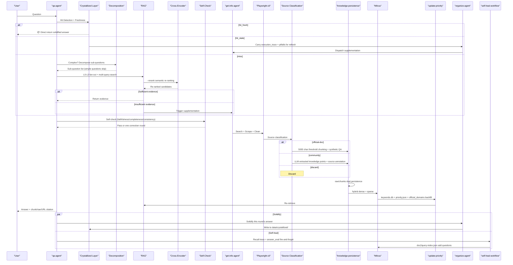
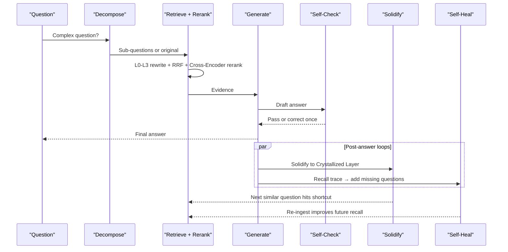
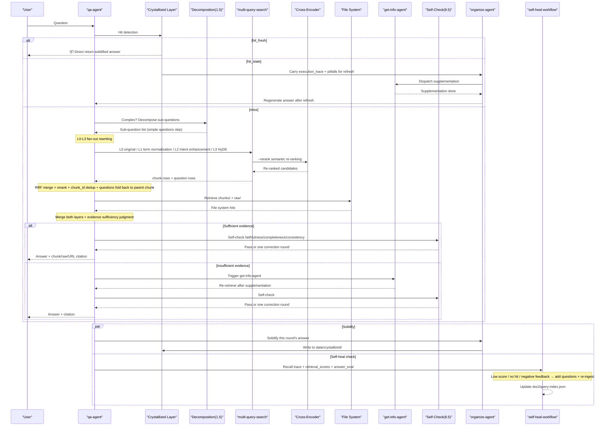
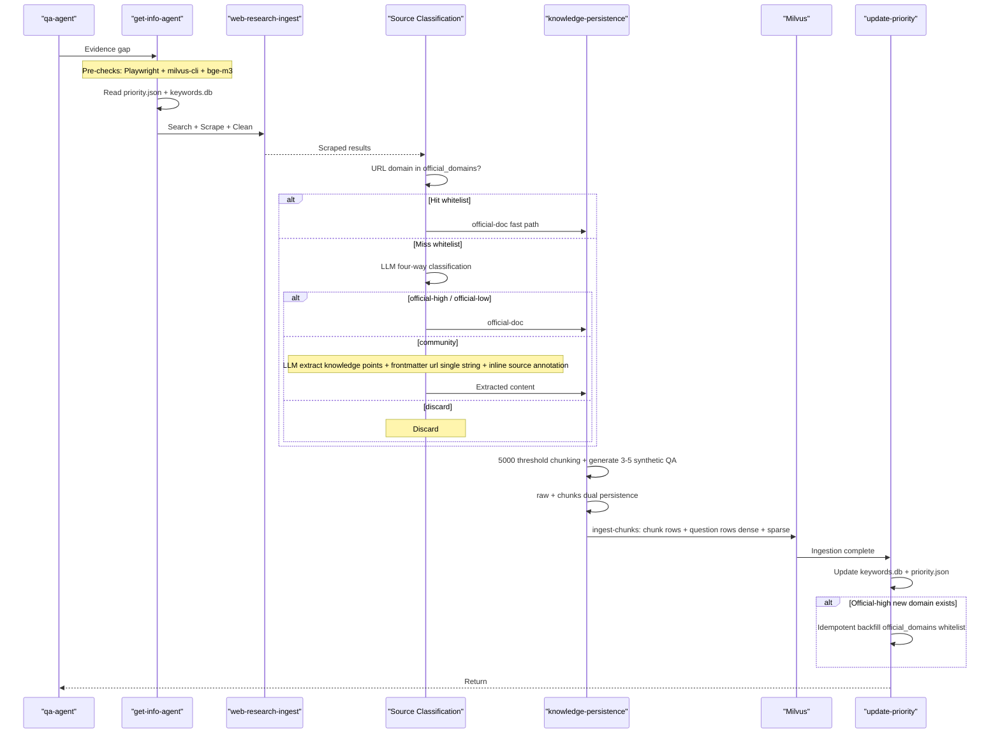

<div align="center">

# brain-base

*Knowledge Base for Claude Code Plugin, enabling RAG capabilities for Claude Code*

[简体中文](./README.md) | [English](./README_en.md)

[](https://claude.com/claude-code)
[](LICENSE)
[](https://milvus.io/)
[](https://www.npmjs.com/package/@playwright/cli)

> **Claude-Code-Agent-Plugin** | **QA First** | **Playwright-cli Ingest** | **Milvus RAG** | **MIT License**

</div>

<div align="center">

</div>

---

## Pain Points

Have you encountered these issues?

| Scenario | Result |
|----------|--------|
| Q&A systems only provide "instant answers" without long-term accumulation | Same questions searched and answered repeatedly, knowledge cannot be reused |
| Only vector databases used, original documents not preserved | Unable to audit sources and context when disputes arise |
| Direct web scraping for every new question | High cost, slow, and easy to pollute the knowledge base |
| Mixed scraping tools with inconsistent calls | Unmaintainable processes, difficult troubleshooting |
| RAG reruns retrieval and synthesis for every query without accumulation | Similar questions require full pipeline rerun, wasting time and tokens |
| Local papers / PDFs / Word / LaTeX cannot be ingested directly | The knowledge base can only wait for web supplementation, your own documents never land in it |

**brain-base** is not "just another retrieval script", but a sustainable, self-evolving knowledge loop:

1. `qa-agent` first checks the self-evolving crystallized layer for solidified answers; if hit and fresh, returns directly.
2. If not hit, performs local RAG retrieval, then decides whether to supplement the knowledge base.
3. `get-info-agent` only triggers external scraping when evidence is insufficient.
4. External materials must be saved to `raw + Milvus + keywords.db` simultaneously (chunks are auto-generated by knowledge-persistence into the Crystallized Layer).
5. `playwright-cli` serves as the unified entry point for external web scraping.
6. After a satisfactory Q&A session, `organize-agent` solidifies the answer into the self-evolving crystallized layer for shortcut returns on similar future questions.

---

## Core Philosophy

This project adheres to three main principles:

1. **Answers must be traceable**: Answers should link back to chunks, raw documents, and source URLs.
2. **Knowledge must be evolvable**: Each knowledge base supplement should be reusable by subsequent retrievals.
3. **Results must be accumulative**: Successfully answered questions should be solidified so similar questions don't require rerunning the RAG pipeline.

This project adopts the [Karpathy LLM Wiki](https://gist.github.com/karpathy/442a6bf555914893e9891c11519de94f) **three-layer architecture**:

| Layer | Responsible for Writing | Function |
|-------|------------------------|----------|
| **Raw Layer** (`data/docs/raw/` + Milvus) | `get-info-agent` (web supplementation) / `upload-agent` (local document upload) | Immutable original evidence, written by two parallel entry points, only supplement/repair, no modification |
| **Self-Evolving Crystallized Layer** (`data/docs/chunks/` + `data/crystallized/`) | `organize-agent` / `knowledge-persistence` | LLM semantic chunking + organized solidified answers, shortcut returns for similar questions |
| **Schema Layer** (`agents/` + `skills/`) | User + Author | Rule files controlling system behavior |



---

## Agentic RAG Architecture

brain-base follows the **Karpathy LLM Wiki** pattern: LLM as the central decision-maker, not a passive retrieval pipeline. The core architecture has three self-reinforcing loops:



**Three self-reinforcing loops**:

| Loop | Trigger | Effect | Result |
|------|---------|--------|--------|
| **Maker-Checker** | Every answer generation | Self-check faithfulness / completeness / consistency → correct once | Prevents hallucinated or incomplete answers |
| **Crystallize** | Satisfactory Q&A | Solidify answer + execution_trace → shortcut on next similar question | Accumulative: similar questions never re-run full RAG |
| **Self-Heal** | Low score / no hit / negative feedback | Add missing-dimension questions → re-ingest affected docs | Retrieval improves over time without manual tuning |

**Core pipeline stages** (each stage is an LLM decision point, not a hardwired rule):

1. **Decompose** (Step 1.5): LLM judges whether the question contains ≥2 independent sub-intents; if yes, splits into 2-4 sub-questions for independent retrieval.
2. **Retrieve + Rerank**: L0-L3 fan-out rewriting → multi-query concurrent retrieval → RRF merge → cross-encoder (`bge-reranker-v2-m3`) semantic re-ranking → chunk_id dedup.
3. **Generate + Self-Check** (Step 8.5): LLM generates answer, then self-evaluates on three dimensions; failed dimensions trigger one correction round.
4. **Solidify + Self-Heal**: Answer solidified to Crystallized Layer for shortcut returns; recall trace triggers background question supplementation and re-ingestion.

---

## Core Capabilities

- **QA Agent**: First checks self-evolving crystallized layer for solidified answers; if not hit, performs L0-L3 fan-out rewriting (original/normalized/intent-enhanced/HyDE) on user questions and retrieves local knowledge base, then decides whether to supplement.
- **Organize Agent (Self-Evolving Crystallized Layer)**: Benchmarked against Karpathy LLM Wiki pattern. After satisfactory Q&A, solidifies answers, execution paths, and encountered pitfalls as Crystallized Skills; hit and fresh → direct return; hit but stale → carries original `execution_trace` and `pitfalls` to guide get-info-agent for precise refresh.
- **Get-Info Agent**: Dispatcher for external supplementation. Orchestrates **Playwright-cli** scraping, cleaning, chunking, and persistence.
- **Upload Agent**: Entry point for user-local document ingestion (parallel to Get-Info Agent). Accepts PDF / Word / PPT / Excel / LaTeX / TXT / MD / images, uniformly converts to Markdown via **MinerU 3.x + pandoc**, then reuses the downstream `knowledge-persistence` pipeline for identical chunking and ingestion.
- **Playwright-cli**: Directly uses official `playwright-cli` command following official repository installation and invocation recommendations.
- **Milvus hybrid index (default bge-m3)**: Dense + sparse dual recall, supporting chunk rows + synthetic question rows (doc2query).
- **Question self-healing**: After answering, `qa-agent` records a recall trace. On low-score hits, no hits, or negative user feedback, an independent background `claude -p` process triggers `self-heal-workflow` to add missing-dimension questions and re-ingest affected documents.
- **Authoritative doc2query index**: `data/eval/doc2query-index.json` is the authoritative source for questions. `ingest-chunks` reads it first and uses chunk frontmatter as fallback.
- **Recall evaluation and source arbitration**: `eval-recall.py` supports recall@K, 6-dimension question coverage checks, and feedback capture; `source-priority.py` annotates chunks with `source_priority` and detects potential source conflicts.
- **5000 Character Chunking Threshold**: Short documents (≤ 5000 chars) remain as single chunks; long documents are split at Markdown semantic boundaries.
- **multi-query-search**: Converts multiple query variants into CLI calls, automatically concurrent retrieval, RRF merging, and deduplication by chunk_id. Optional `--rerank` flag enables bge-reranker-v2-m3 cross-encoder semantic re-ranking after RRF (soft dependency, silently falls back to pure RRF if model unavailable).
- **Complex Question Decomposition**: qa-workflow Step 1.5 identifies four types of complex questions (multi-part / comparison / causal-chain / solution-selection) and automatically decomposes them into 2-4 independent sub-questions, each with its own L0-L3 rewriting and retrieval, then merges evidence for a comprehensive answer. Simple factual questions skip decomposition.
- **Answer Quality Self-Check (Maker-Checker Loop)**: qa-workflow Step 8.5 performs structured self-evaluation after answer generation on three dimensions — faithfulness (every claim backed by evidence), completeness (all question aspects covered), consistency (no internal contradictions). Failed dimensions trigger one correction round; failure does not block the answer. Results are recorded in the recall trace `answer_eval` field.
- **Skill Workflows**: Production-grade workflow constraints for query rewriting, evidence judgment, scraping process, persistence process, and crystallized layer hit/refresh flows.
- **Dynamic Site Priority**: Updates `priority.json` and `keywords.db` based on actual hit results.
- **Non-Official Source Content Extraction**: Blogs, tutorials, Q&A posts are not stored whole; LLM extracts useful knowledge points and reorganizes them into documents with `> Source: <url>` traceability annotations. Each URL is stored as an independent document (frontmatter `url` single string + inline annotations), searchable via grep without additional database.
- **Official Domain Self-Learning Whitelist**: `priority.json.official_domains` serves as classification fast lane; new domains LLM-high-confidence-classified as official are idempotently backfilled by `update-priority`, becoming more accurate over time.

---

## Workflow Overview

### QA Process

1. Receive user question.
2. **Step 0: Self-Evolving Crystallized Layer Hit Detection** (Crystallized Layer Shortcut):
   - `hit_fresh` → Directly return solidified answer, marking `> 📦 From self-evolving crystallized layer solidified answer...` at the beginning
   - `hit_stale` → Delegate to `organize-agent` carrying `execution_trace` and `pitfalls` to dispatch get-info-agent for refresh, then regenerate answer
   - `miss` / `degraded` → Continue with the following RAG process
3. **Step 1.5: Complex Question Decomposition** — for multi-part / comparison / causal-chain / solution-selection questions, decompose into 2-4 independent sub-questions; simple factual questions skip this step.
4. Perform L0-L3 fan-out rewriting, producing 4-6 query variants:
   - **L0** User original sentence
   - **L1** Term normalization (abbreviation expansion / Chinese-English aliases / standard product names)
   - **L2** Intent enhancement (action words / step words / version words / time words)
   - **L3** HyDE hypothetical answer (fabricate an "ideal answer beginning" to use as query)
5. Prioritize local knowledge retrieval:
   - First check `data/docs/raw/` (Raw Layer)
   - Then check `data/docs/chunks/` (Crystallized Layer)
   - Then call `python bin/milvus-cli.py multi-query-search --rerank` to throw all variants into concurrent retrieval + RRF merging + cross-encoder re-ranking + deduplication by `chunk_id` (synthetic question rows automatically fold back to parent chunk)
6. Merge file system hits with multi-query-search results, prioritizing chunks hit by both layers.
7. Judge evidence sufficiency and freshness.
8. Only trigger `get-info-agent` when local evidence is insufficient and external knowledge is clearly needed.
9. Answer user based on evidence.
10. **Step 8.5: Answer quality self-check (Maker-Checker loop)** — evaluate faithfulness / completeness / consistency; if any dimension fails, correct once and re-check; failure does not block answer delivery.
11. **Step 9: Recall trace + self-heal trigger check** — record `question / chunk_ids / doc_ids / retrieval_scores / answer_summary / session_id`; on low-score or negative feedback, write a signal file under `data/eval/self-heal-pending/` and trigger `self-heal-workflow` in fire-and-forget mode.
12. **Step 10: Delegate to `organize-agent` to solidify this round's answer** — when solidification conditions are met, asynchronously write to `data/crystallized/` for shortcut return on similar future questions.



### Get-Info Process

1. Receive question, query variants, and evidence gaps from `qa-agent`.
2. Perform pre-checks (Playwright-cli, `milvus-cli`, local bge-m3 model availability).
3. Read `data/priority.json` and `data/keywords.db`.
4. Call `get-info-workflow` to orchestrate sub-processes.
5. Call `playwright-cli-ops` and `web-research-ingest` to execute search, scraping, and preliminary cleaning.
6. **Source Classification and Content Extraction**: Two-level classification by "whitelist + LLM" to determine if document belongs to `official-doc` / `community` / `discard`; `community` sources enter extraction flow, reorganized as new Markdown with `> Source: <url>` annotations per knowledge point; `discard` directly dropped.
7. Call `knowledge-persistence` to save raw Markdown, perform LLM chunking by 5000 character threshold rules.
8. **For each chunk, call LLM to generate 3-5 synthetic QA questions**, written to chunk frontmatter `questions: [...]`.
9. Write to Milvus by chunk (`ingest-chunks` writes both chunk rows and question rows, dense + sparse in hybrid mode).
10. Update `keywords.db` and `priority.json` (`update-priority` idempotently backfills new domains LLM-high-confidence-classified as official to `official_domains` whitelist).



---

## Persistence Design

### Why Keep Both raw and chunks

This project is not just a vector database. The file system is also a first-class storage layer.

1. `raw` (Raw Layer) preserves complete cleaned Markdown, suitable for auditing, review, and preserving full context.
2. `chunks` (Crystallized Layer) preserves LLM semantically chunked thematic fragments, grep-able and RAG-ready, suitable for precise retrieval and citation.
3. Milvus is only responsible for storage and retrieval, not for generating embeddings out of thin air.

### Chunking Principles (with 5000 Character Hard Threshold)

Chunking is dominated by Claude Code or Codex models, not complex local chunking systems. Model chunking **must obey** the following hard constraints:

1. **Body ≤ 5000 characters → Entire document becomes 1 chunk, do not split.** This prevents short MDs from being unnecessarily chopped into multiple pieces.
2. **Body > 5000 characters → Split at Markdown semantic boundaries**, each chunk max 5000 characters, target 2000-5000 characters/chunk.
3. Prioritize splitting by H2/H3 heading hierarchy; secondarily by step groups, FAQ Q&A pairs.
4. **Do not hard-split in the middle of code blocks, tables, command examples, or lists.**
5. Individual chunks maintain thematic completeness for Grep and RAG.
6. Light overlap ≤ 200 characters allowed when necessary, but avoid duplicate pollution.
7. Extreme degradation: When a single semantic block itself > 5000 characters with no safe split points (e.g.,超长 code block), character hard-split is allowed with `truncated: true` marker.

### Chunk Goals

A high-quality chunk must simultaneously satisfy:

1. Understandable main theme when taken alone.
2. Preserves heading path, summary, keywords, `questions` synthetic question list for Grep + vectorization dual recall.
3. Can trace back to raw document and original URL.
4. Short enough to avoid mixing multiple unrelated themes; complete enough to not lose context.

### Synthetic QA Index (doc2query)

Before each chunk is persisted, LLM generates 3-5 synthetic questions in user voice, written to frontmatter. In addition, `data/eval/doc2query-index.json` acts as the authoritative question index used by self-healing and re-ingestion:

```yaml
questions: ["How to create Claude Code subagent?", "Required frontmatter fields for subagent?", "Relationship between subagent and plugin?"]
```

`bin/milvus-cli.py ingest-chunks` reads questions from `doc2query-index.json` first; if no matching `chunk_id` exists there, it falls back to chunk frontmatter. Each question is embedded independently (row type `kind=question`, `chunk_id` points to the parent chunk). During retrieval, these question rows participate in RRF alongside body chunk rows, finally deduplicated by `chunk_id`, **significantly reducing the semantic gap between user colloquial queries and document terminology**.

The self-healing flow only adds questions and never edits chunk body text: low-score hit or negative feedback → write a signal file under `data/eval/self-heal-pending/` → independent `claude -p` triggers `self-heal-workflow` → update `doc2query-index.json` → run `ingest-chunks --replace-docs` for affected documents.

---

## Milvus and Vectorization Boundaries

These are the boundaries that must be obeyed in the current project:

1. **Milvus is a vector database, not a general embedding generator.**
2. Dense vectors must come from providers capable of returning embeddings.
3. Providers can be local embedding models or online embedding APIs.
4. General LLMs that can only return text, not embeddings, cannot directly replace the vectorization stage.
5. **Current default provider is `BAAI/bge-m3`** (hybrid, dense 1024-dim + sparse), first startup requires downloading ~1.4 GB model. CPU runnable but slow vectorization; set `KB_EMBEDDING_DEVICE=cuda` for significant GPU acceleration. For lightweight fallback to 384-dim dense-only, set `KB_EMBEDDING_PROVIDER=sentence-transformer`.

---

## Agent and Skill Layers

### Agents

1. `qa-agent`: Main Q&A Agent. Check crystallized layer → Check RAG → Trigger get-info-agent supplementation when necessary → Answer → Emit recall trace → Trigger self-heal-workflow when needed → Trigger organize-agent solidification.
2. `organize-agent`: **Self-Evolving Crystallized Layer Dispatcher Agent**. Responsible for solidification, refresh, feedback processing, health checks; **does not modify raw layer**, carries original `execution_trace` + `pitfalls` to call get-info-agent during refresh.
3. `get-info-agent`: External supplementation Agent. Orchestrates Playwright-cli scraping, cleaning, chunking, persistence.
4. `upload-agent`: User local document upload Agent (parallel to `get-info-agent`, the two entry points converge at the `knowledge-persistence` layer). Receives local files → `doc-converter` completes storage (original file archive + raw Markdown persistence + image resource preservation) → then hands off to `knowledge-persistence` for Agent/LLM semantic chunking and unified ingestion.

### Skills

QA, Get-Info, Organize, and Upload — these four agents dispatch the following skills:

1. `qa-workflow`: Crystallized layer hit detection (Step 0), L0-L3 fan-out rewriting, multi-query-search invocation, evidence sufficiency judgment, recall trace and self-heal trigger (Step 9), triggering organize-agent solidification (Step 10).
2. `crystallize-workflow`: Crystallized layer hit detection / freshness judgment / write / refresh; semantics for `data/crystallized/index.json` and `<skill_id>.md` check-in/check-out.
3. `crystallize-lint`: Crystallized layer health checks, periodic cleanup of rejected / garbage entries, detection of orphan files and corrupted files.
4. `playwright-cli-ops`: Stable Playwright-cli invocation.
5. `web-research-ingest`: Search, scrape, and clean web content.
6. `knowledge-persistence`: 5000 character threshold chunking, synthetic QA generation, raw persistence (Raw Layer) + chunks persistence (Crystallized Layer), Milvus hybrid persistence. **Common downstream for both get-info and upload entry points.**
7. `get-info-workflow`: Orchestrates execution order and failure strategy of external supplementation sub-skills.
8. `upload-ingest`: User document ingestion workflow, parallel to `get-info-workflow`; first dispatches `doc-converter` for upload → storage, then hands raw Markdown to `knowledge-persistence`.
9. `self-heal-workflow`: Background recall self-healing workflow. Reads recall trace / user feedback, records feedback, adds missing-dimension questions, writes `doc2query-index.json`, and re-ingests affected documents.
10. `update-priority`: Updates keyword and priority state (called only by get-info path; upload path has no URL/site and skips it).
11. `brain-base-skill`: **External Agent Invocation Manual** — installed under `~/.claude/skills` or `~/.codex/skills`, teaching other Agents how to invoke the two brain-base entry points via `claude -p ... --plugin-dir ... --agent brain-base:qa-agent|upload-agent --dangerously-skip-permissions`.

---

## External Agent Invocation of brain-base

brain-base can not only be used as a Plugin in Claude Code, but any system with Claude Code installed can invoke it via command line.

### Recommended: brain-base-cli (Unified External CLI)

`bin/brain-base-cli.py` is the unified invocation entry point for external Agents, providing 8 commands with structured JSON output and `stream-json` real-time intermediate state visibility — no need to manually assemble `claude -p` parameters:

```bash
# Health check
python bin/brain-base-cli.py health

# Pure vector retrieval (no LLM, fast)
python bin/brain-base-cli.py search --query "bge-m3 usage" --query "BGE-M3 embedding" --rerank

# Check if document already exists
python bin/brain-base-cli.py exists --url "https://docs.anthropic.com/..."

# Full Q&A pipeline (LLM-driven, includes retrieval + supplementation + self-check)
python bin/brain-base-cli.py ask "What is the difference between search and ask?"

# URL supplementation (calls get-info-agent for scraping + ingestion)
python bin/brain-base-cli.py ingest-url --url "https://example.com/doc" --topic "topic"

# Local file ingestion (calls upload-agent)
python bin/brain-base-cli.py ingest-file --path README.md

# Plain text ingestion (Markdown content passed directly, no temp file needed)
python bin/brain-base-cli.py ingest-text --content "# Title\nContent..." --title "Document Title"

# Solidification feedback (confirm/reject/supplement previous answer by session_id)
python bin/brain-base-cli.py feedback --session-id <ID> --status confirmed
```

All commands output structured JSON. The `--output-format` parameter defaults to `stream-json` (real-time intermediate state visible), and can be switched to `text` or `json`.

For detailed command matrix and integration strategy, see `skills/brain-base-skill/SKILL.md` and `md/BRAIN_BASE_EXTERNAL_CLI_IMPLEMENTATION.md`.

### Low-level: Direct claude -p Invocation

Two parallel entry points (choose agent based on intent):

| Scenario | Command |
|----------|---------|
| **Q&A / Web supplementation** | `claude -p "question" --plugin-dir <PATH> --agent brain-base:qa-agent --dangerously-skip-permissions` |
| **Upload local document for ingestion** | `claude -p "ingest /path/to/file.pdf" --plugin-dir <PATH> --agent brain-base:upload-agent --dangerously-skip-permissions` |

Deployment form (independent from the two agents above):

| Scenario | Configuration |
|----------|---------------|
| **Plugin Mode** | brain-base installed in `~/.claude/plugins/` |
| **Project-level Mode** | brain-base stored as regular project, referenced via `--plugin-dir` |

### Project-level Invocation Steps

When brain-base is used as a project-level project, other projects wanting to invoke it:

**1. Deploy brain-base-skill**

Copy `skills/brain-base-skill/` to the invoker machine's `~/.claude/skills/` or `~/.codex/skills/`:

```bash
cp -r skills/brain-base-skill ~/.claude/skills/
```

**2. Determine brain-base Path**

The invoker needs to know brain-base's absolute path. Three options:

- **Environment Variable (Recommended)**: Set in `.env`: `BRAIN_BASE_PATH=/absolute/path/to/brain-base`
- **Relative Path**: If invoker and brain-base have fixed directory relationship (e.g., `~/projects/brain-base` and `~/projects/caller-project`)
- **Claude Code Lookup**: Ask Claude Code "where is the brain-base project"

**3. Invocation Example**

Q&A example:

```bash
export BRAIN_BASE_PATH="/home/user/projects/brain-base"

claude -p "How to configure Claude Code subagent?" \
  --plugin-dir "$BRAIN_BASE_PATH" \
  --agent brain-base:qa-agent \
  --dangerously-skip-permissions
```

Upload local document example:

```bash
claude -p "Please ingest the following file: /home/user/papers/knowledge-distillation.pdf" \
  --plugin-dir "$BRAIN_BASE_PATH" \
  --agent brain-base:upload-agent \
  --dangerously-skip-permissions
```

More prompt templates and batch invocation are documented in the "upload-agent prompts" section of `skills/brain-base-skill/SKILL.md`.

### Why `--dangerously-skip-permissions` is Required

qa-agent execution triggers `get-info-agent` for web scraping, file writing, etc. Without this parameter, Claude Code would pop up permission confirmation dialogs at every step, causing:

- Process hangs when called as subprocess with no one to respond
- Automated flows frequently interrupted

Therefore must skip permission confirmation when invoking from external Agent.

### Solidification Feedback

After Q&A completion, feedback needs to be sent to confirm solidification:

```bash
claude -p -c "User did not reject, confirm solidify previous round's answer" \
  --plugin-dir "$BRAIN_BASE_PATH" \
  --agent brain-base:qa-agent \
  --dangerously-skip-permissions
```

More details see `skills/brain-base-skill/SKILL.md`.

---

## Quick Start

The following commands default to execution in the `brain-base` repository root directory. If you're not currently in that directory, please enter it first; the `.` in `--plugin-dir .` refers to the current directory.

If you want the "long-term runnable, full-permission automation, background supplementation strategy" usage, see the complete manual:

- [OPERATIONS_MANUAL.md](./md/OPERATIONS_MANUAL.md) | [English](./md/OPERATIONS_MANUAL_en.md)

### 1. Start Milvus

```bash
docker compose up -d
```

Verify Milvus:

```bash
curl http://localhost:9091/healthz
```

### 2. Install Python Dependencies

The following commands install to your currently selected Python environment. If using a virtual environment, please activate it first before installation.

**Method A: Install everything at once** (recommended)

```bash
python -m pip install -r requirements.txt
```

**Method B: Install step-by-step by capability**

```bash
# 1. Q&A / retrieval / ingestion (shared by get-info + upload entry points)
python -m pip install -U "pymilvus[model]" sentence-transformers FlagEmbedding

# 2. Local document upload ingestion (upload-agent only; PDF/DOCX/PPTX/XLSX/images)
python -m pip install -U 'mineru[pipeline]>=3.1,<4.0'
```

Notes:

1. `pymilvus[model]` provides vectorization helper functions (including BGE-M3 / SentenceTransformer / OpenAI three wrappers).
2. `sentence-transformers` is the underlying dependency for BGE-M3 and sentence-transformer models.
3. `FlagEmbedding` is the official inference library for BAAI/bge-m3; first call automatically downloads ~1.4 GB model to `~/.cache/huggingface/`.
4. `mineru[pipeline]` is the **MinerU 3.x** document parsing backend invoked by upload-agent (permissive Apache-2.0 base license, strong CJK handling); first run automatically downloads ~2 GB model. If you don't plan to upload local PDF/DOCX etc., you can skip it.
5. **Optional system dependency `pandoc`**: only required when uploading `.tex` documents; see https://pandoc.org/installing.html.
6. **(Highly recommended, GPU acceleration)**: MinerU runs local torch. CPU inference takes ~5 minutes per PDF page; swapping to CUDA torch drops this to ~7 sec/page (45× speedup, RTX 4060 Ti tested).
   ```bash
   # After installing MinerU above, verify CUDA availability
   python -c "import torch; print(torch.cuda.is_available())"
   # If False and you have an NVIDIA GPU (check via nvidia-smi), swap to the CUDA build:
   python -m pip uninstall -y torch torchvision
   python -m pip install torch torchvision --index-url https://download.pytorch.org/whl/cu124
   ```
   **Note**: Chinese pip mirrors (USTC / Aliyun / Tsinghua etc.) usually only sync the CPU build of torch. You MUST use the official PyTorch index `https://download.pytorch.org/whl/cu124` to get CUDA wheels. CUDA version selection: if `nvidia-smi` reports CUDA Version ≥ 12.4, `cu124` works; older cards use `cu121` or `cu118`.

### 3. Confirm `milvus-cli` Availability
  
 1. First inspect current Milvus / provider configuration:
  
  ```bash
 python bin/milvus-cli.py inspect-config
  ```
  
 2. Confirm local vectorization capability available via pre-check command:
  
  ```bash
  python bin/milvus-cli.py check-runtime --require-local-model --smoke-test
  ```

### 4. Confirm Playwright-cli Availability (Required for Agent Integration Scenarios)

`get-info-agent`'s external scraping pipeline depends on official **Playwright-cli**. Invocation constraint: prioritize `playwright-cli`, secondarily `npx --no-install playwright-cli`, do not silently substitute other scrapers.

1. Install official CLI:

```bash
npm install -g @playwright/cli@latest
```

This command installs `playwright-cli` to global Node environment.

2. For Agent integration with Claude Code, Codex, Cursor, Copilot, etc., install CLI skills per official README (this project treats as required step):

```bash
playwright-cli install --skills
```

3. Verification command:

```bash
playwright-cli --help
```

4. If you already have `@playwright/cli` locally installed in current project, you can also use:

```bash
npx --no-install playwright-cli --help
```

### 5. Start QA Agent

```bash
claude --plugin-dir . --agent brain-base:qa-agent
```

Here `.` represents current directory, so this command requires you to be in the `brain-base` repository root directory. If you're currently in its parent directory, use instead:

```bash
claude --plugin-dir ./brain-base --agent brain-base:qa-agent
```

#### For fully hands-off operation

```bash
claude --plugin-dir . --agent brain-base:qa-agent --dangerously-skip-permissions
```

### 6. If you have installed and enabled this plugin, you can also configure default agent in `.claude/settings.json`

```json
{
  "$schema": "https://json.schemastore.org/claude-code-settings.json",
  "agent": "brain-base:qa-agent"
}
```

Configuring `agent` alone does not substitute `--plugin-dir .`. If you're directly temporarily loading the plugin from current repository directory, you still need to use the above command to start.

### 7. Start Asking Questions

Local knowledge Q&A:

```text
Please tell me how to create Claude Code subagent?
```

Force external knowledge supplementation:

```text
Please first supplement latest Claude Code documents from the web, then answer how to create subagent.
```

---

## Data and Configuration

### `data/priority.json`

This file maintains site priorities, keywords, and last update time.

```json
{
  "version": "1.1.0",
  "update_interval_hours": 24,
  "last_update": "2026-04-12T00:00:00Z",
  "official_domains": [
    "docs.anthropic.com",
    "github.com/anthropics"
  ],
  "sites": {
    "anthropic": {
      "priority": 10,
      "keywords": ["claude-code", "subagent", "plugin"]
    }
  }
}
```

Field descriptions:

1. **`official_domains`**: Official domain whitelist (can be empty array). `get-info-workflow` queries whitelist first when classifying non-official/official sources, if miss then LLM comprehensive judgment; new domains LLM-high-confidence-classified as official are idempotently backfilled here by `update-priority`. Only serves as classification acceleration channel, not security boundary, users can manually edit anytime.
2. **`sites.<site_id>.priority`**: Site priority score, higher values indicate retrieval priority.
3. **`sites.<site_id>.keywords`**: Site-associated keywords for keyword reinforcement.

### `data/keywords.db`

Records keywords, sites, query counts, last query times. It does not replace `priority.json`, but provides factual basis for priority updates.

Table structure:

1. **`keywords`**: Keyword popularity records (site_id, keyword, query_count, last_query_at).

Community source URLs are not separately stored in tables: they are written directly as document metadata in the chunk frontmatter `url` field (single string, one URL per doc) and inline `> Source: <url>` annotations, traceable via grep or file reading.

### Directory Structure

```text
brain-base/
├── .mcp.json
├── requirements.txt               # Python deps: pymilvus[model] / FlagEmbedding / mineru[pipeline]
├── agents/
│   ├── qa-agent.md
│   ├── get-info-agent.md         # External supplementation entry
│   ├── upload-agent.md           # Local document upload entry (parallel to get-info-agent)
│   └── organize-agent.md         # Self-Evolving Crystallized Layer Dispatcher Agent
├── skills/
│   ├── qa-workflow/
│   ├── crystallize-workflow/     # Crystallized Layer Hit Detection / Write / Refresh
│   ├── crystallize-lint/         # Crystallized Layer Health Checks
│   ├── get-info-workflow/
│   ├── upload-ingest/            # User document ingestion workflow (parallel to get-info-workflow)
│   ├── self-heal-workflow/        # Recall self-healing workflow (triggered by background claude -p)
│   ├── playwright-cli-ops/
│   ├── web-research-ingest/
│   ├── knowledge-persistence/    # Shared downstream for both entry points
│   ├── update-priority/
│   └── brain-base-skill/         # External Agent Invocation Manual (documents both qa-agent and upload-agent entries)
├── bin/
│   ├── milvus-cli.py
│   ├── eval-recall.py             # recall@K, feedback, coverage, doc2query-index
│   ├── source-priority.py         # source_priority annotation and source conflict detection
│   ├── doc-converter.py          # MinerU + pandoc + native TXT/MD uniform conversion to Markdown
│   ├── brain-base-cli.py         # Unified external Agent invocation CLI (8 commands, structured JSON output)
│   └── scheduler-cli.py
├── planning/                     # Project convergence and transformation plans
├── data/                         # gitignored, auto-created at runtime
│   ├── docs/
│   │   ├── raw/                  # Raw Layer — written by get-info-agent / upload-agent, LLM read-only
│   │   └── uploads/              # Original user-uploaded files archive (written by upload-agent)
│   ├── docs/chunks/              # Crystallized Layer — written by knowledge-persistence (LLM semantic chunking)
│   ├── crystallized/             # Crystallized Layer — written by organize-agent (solidified answers)
│   │   ├── index.json            # Solidified skill index
│   │   └── <skill_id>.md         # Each solidified skill one file
│   ├── priority.json
│   ├── keywords.db
│   └── eval/
│       ├── doc2query-index.json   # Authoritative questions index
│       ├── coverage-report.json   # 6-dimension coverage report
│       ├── feedback.db            # User feedback SQLite database
│       ├── results/               # Recall evaluation results
│       └── self-heal-pending/     # Self-heal signal files
└── mcp/
    └── milvus-rag/
```

---

## CLI Tools

```bash
# View current Milvus/provider configuration
python bin/milvus-cli.py inspect-config

# Check local vectorization model and vectorization capability
python bin/milvus-cli.py check-runtime --require-local-model --smoke-test

# Ingest chunk Markdown to Milvus (default append; hybrid mode auto-writes dense + sparse;
# questions are read from data/eval/doc2query-index.json first, with frontmatter as fallback;
# each question is written as an independent row, kind=question)
python bin/milvus-cli.py ingest-chunks --chunk-pattern "data/docs/chunks/*.md"

# Overwrite/replace a document (delete then write, use with caution)
python bin/milvus-cli.py ingest-chunks --chunk-pattern "data/docs/chunks/claude-code-agent-teams-2026-04-12-*.md" --replace-docs

# Dense retrieval (single query, legacy call)
python bin/milvus-cli.py dense-search "search keyword"

# Hybrid retrieval (single query, bge-m3 dense+sparse)
python bin/milvus-cli.py hybrid-search "search keyword"

# Multi-query fan-out retrieval (recommended main path)
# Each --query corresponds to one L0/L1/L2/L3 rewrite; CLI auto-concurrent retrieval + RRF merge + dedup by chunk_id
python bin/milvus-cli.py multi-query-search \
  --query "claude code subagent configuration" \
  --query "Claude Code subagent configuration" \
  --query "how to create Claude Code subagent" \
  --query "Claude Code subagent defined through YAML files under .claude/agents..." \
  --top-k-per-query 20 --final-k 10 --rerank

# Build recall evaluation queries from chunk frontmatter questions
python bin/eval-recall.py build-queries --chunks-dir data/docs/chunks --output data/eval/queries.json

# Run Milvus + embedding recall evaluation
python bin/eval-recall.py run --queries data/eval/queries.json --mode embedding --top-k 10

# Run full brain-base recall evaluation (grep + embedding)
python bin/eval-recall.py run --queries data/eval/queries.json --mode full --top-k 10

# Record user feedback and convert high-rated feedback into real evaluation queries
python bin/eval-recall.py record-feedback --question "..." --rating 5 --type positive --chunk-ids "[\"chunk-id\"]" --doc-ids "[\"doc-id\"]"
python bin/eval-recall.py feedback-to-queries --output data/eval/queries-real.json

# Generate 6-dimension question coverage report
python bin/eval-recall.py coverage-check --chunks-dir data/docs/chunks --output data/eval/coverage-report.json

# Update the authoritative doc2query index (used by self-healing)
python bin/eval-recall.py update-doc2query-index --chunk-id "<chunk-id>" --questions "[\"question 1\", \"question 2\"]"

# Annotate source_priority and detect source conflicts
python bin/source-priority.py add-priority --apply
python bin/source-priority.py detect-conflicts

# Check if priority update time window reached
python bin/scheduler-cli.py --check

# Update keyword
python bin/scheduler-cli.py --keyword "claude-code" --site anthropic
```

### Manual Offline Evaluation

Here, "offline" means **you do not need to start `qa-agent`, `get-info-agent`, Playwright-cli, or any web scraping flow**. However, the `run` subcommand still requires your local **Milvus + embedding runtime** to be available.

Minimal sequence:

1. Confirm Milvus and local vectorization runtime are available:

```bash
python bin/milvus-cli.py inspect-config
python bin/milvus-cli.py check-runtime --require-local-model --smoke-test
```

2. If you do not yet have an evaluation query set, build it from frontmatter `questions` in `data/docs/chunks/`:

```bash
python bin/eval-recall.py build-queries --chunks-dir data/docs/chunks --output data/eval/queries.json
```

3. Run embedding-only evaluation manually:

```bash
python bin/eval-recall.py run --queries data/eval/queries.json --mode embedding --top-k 10
```

4. Run full evaluation manually (grep + embedding):

```bash
python bin/eval-recall.py run --queries data/eval/queries.json --mode full --top-k 10
```

5. Compare two evaluation runs if needed:

```bash
python bin/eval-recall.py diff data/eval/results/<old>.json data/eval/results/<new>.json
```

Additional notes:

- **`build-queries` / `diff` / `record-feedback` / `feedback-to-queries`** can run without Milvus.
- **`run`** writes reports to `data/eval/results/`, which is convenient for manual baseline comparison.
- Current baseline: `data/eval/queries.json` contains 81 synthetic queries, and both `embedding` and `full` paths currently achieve Recall@1/3/5 = 100%.

### Provider Switching and Collection Rebuild

Switching `KB_EMBEDDING_PROVIDER` (e.g., bge-m3 ↔ sentence-transformer) changes dense dimension and schema:

1. CLI fails fast on dim mismatch or schema mismatch, will not silently write dirty data.
2. Must drop old collection before re-ingesting; simplest approach is delete collection in Milvus then run `ingest-chunks`, CLI will rebuild schema per current provider.
3. Default provider is already `bge-m3` (hybrid, dense 1024-dim + sparse). For fallback to sentence-transformer, set `KB_EMBEDDING_PROVIDER=sentence-transformer`, dense becomes 384-dim, sparse field empty (dense-only retrieval).

---

## Data Storage Warning

> This Plugin will continuously write knowledge to the `data/` directory. As usage time grows, data volume will keep increasing.
>
> Strongly recommend installing the Plugin in a **project-level directory**, not directly piling up in user-level global configuration directory for long-term use.

---

## Milvus CLI
  
 This project interacts with Milvus directly through `bin/milvus-cli.py` and no longer exposes Milvus through MCP.
  
 Common commands include:
  
 ```bash
 python bin/milvus-cli.py inspect-config
 python bin/milvus-cli.py check-runtime --require-local-model --smoke-test
 python bin/milvus-cli.py ingest-chunks --chunk-pattern "data/docs/chunks/*.md"
 python bin/milvus-cli.py multi-query-search --query "..."
 ```
  
 Milvus retrieval, health checks, and ingestion mentioned in Agent / Skill docs should all map to these CLI commands.
 
 ---

## Current Implementation Status

This repository currently completed:

1. All `skills` and `agents` elevated to production-grade workflow definitions.
2. Clear collaboration boundaries for QA, Get-Info, Organize, and Upload four types of Agents/Workflows.
3. raw/chunks dual-replica persistence + 5000 character threshold chunking rules.
4. Default BGE-M3 hybrid ingestion pipeline (dense + sparse), `ingest-chunks` end-to-end available.
5. Synthetic QA (doc2query) index layer: 3-5 questions per chunk independently vectorized.
6. multi-query-search CLI: L0-L3 fan-out + RRF merge + dedup by chunk_id.
7. Non-official source content extraction and traceability annotation: whitelist fast lane + LLM four-way classification + `update-priority` self-learning backfill `official_domains`, full traceability in community docs `url` frontmatter field (one URL per doc) and inline `> Source: <url>` annotations.
8. **Self-Evolving Crystallized Layer (Crystallized Skill Layer)**: `organize-agent` + `crystallize-workflow` + `crystallize-lint` + `bin/crystallize-cli.py` maintain hot/cold two-tier solidified answers; low-value questions skipped, high-value questions enter hot, medium-value enter cold observation zone; cold answers reaching hit threshold can be auto or manually promoted.
9. **Local document upload ingestion (Upload Ingest path)**: `upload-agent` + `upload-ingest` + `bin/doc-converter.py` parallel to `get-info-*`, converging at the `knowledge-persistence` layer; supports PDF / DOCX / PPTX / XLSX / LaTeX / TXT / MD / PNG / JPG / PY / TS / GO / RS. Frontmatter tag `source_type: user-upload`, zero schema migration via Milvus `enable_dynamic_field=True`.
10. **Evidence credibility and freshness annotation**: qa-workflow mandates output of source and freshness evidence table, tiered by `source_type` and `age_days` into Tier-1/2/3; >90 days prompts freshness risk, >180 days suggests evidence refresh.
11. **Content hash deduplication on ingestion**: raw Markdown body computes `content_sha256`, pre-ingestion `hash-lookup` for dedup; historical documents backfilled via `backfill-hashes`; `find-duplicates` available for periodic health checks.
12. **Offline smoke test framework**: `pytest tests/smoke -q` covers crystallize-cli, milvus-cli filesystem commands, P2-1 hash dedup trio, P2-3 eval-recall CLI, totaling 55 tests; Milvus-dependent integration tests skipped by default.
13. **Progress and acceptance documentation**: `BRAIN_BASE_CHARTER.md` preserves design charter, `BRAIN_BASE_PROGRESS.md` tracks pain-point completion status and remaining roadmap in tabular form.
14. **Recall evaluation baseline and feedback loop (P2-3 Phase 1/2/3)**: `bin/eval-recall.py` can build `data/eval/queries.json` from chunk frontmatter questions, and evaluate embedding-only vs. full (grep+embedding) recall separately; current 81 synthetic queries achieve Recall@1/3/5 = 100% on both paths. Also supports `record-feedback` writing to `data/eval/feedback.db`, then `feedback-to-queries` generating real user query evaluation sets.
15. **Cross-Encoder Re-ranking (Agentic RAG P0)**: `multi-query-search --rerank` enables `bge-reranker-v2-m3` cross-encoder semantic re-ranking after RRF merge; soft dependency, silently falls back to pure RRF if model unavailable. qa-workflow Step 2.5 recommends always adding `--rerank`.
16. **Complex Question Decomposition (Agentic RAG P0)**: qa-workflow Step 1.5 identifies four types of complex questions (multi-part / comparison / causal-chain / solution-selection), automatically decomposes into 2-4 independent sub-questions, each with its own L0-L3 rewriting and retrieval, then merges evidence for a comprehensive answer. Simple factual questions skip decomposition.
17. **Answer Quality Self-Check / Maker-Checker Loop (Agentic RAG P0)**: qa-workflow Step 8.5 performs structured self-evaluation after answer generation on faithfulness / completeness / consistency; failed dimensions trigger one correction round; failure does not block the answer. Results are recorded in the recall trace `answer_eval` field.
18. **Unified External Agent Invocation CLI (brain-base-cli)**: `bin/brain-base-cli.py` provides 8 commands (`health` / `search` / `exists` / `ask` / `ingest-url` / `ingest-file` / `ingest-text` / `feedback`), all outputting structured JSON with `stream-json` real-time intermediate state by default; auto-handles `session_id` UUID format conversion and `HF_HUB_OFFLINE` offline model loading, so external Agents don't need to worry about low-level `claude -p` parameter details. See `md/BRAIN_BASE_EXTERNAL_CLI_IMPLEMENTATION.md`.

Current high-priority pain points (P0/P1) are completed; P2 content hash deduplication and recall evaluation baseline are done. Agentic RAG core features (cross-encoder re-ranking, complex question decomposition, answer quality self-check) are delivered. Recommended extension priorities based on real usage feedback:

1. Batch upload progress + resumable upload (P2-2): implement when starting to bulk-import PDFs/papers.
2. Retrieval quality evaluation expansion (P2-3 follow-up): integrate qa-agent auto-feedback recording, add hard negatives and doc2query self-healing.
3. Crystallized feedback auto-closure (T4): reduce `pending` → `confirmed` reliance on manual user feedback.
4. Full data export (P3-3): implement when knowledge base starts cross-machine migration or team sharing.
5. Crystallized layer embedding index (P3-1): implement when crystallized skill count exceeds 200.

